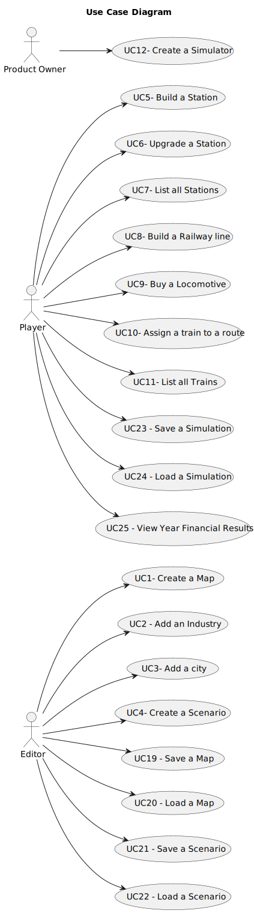

# Use Case Diagram (UCD)

**In the scope of this project, there is a direct relationship of _1 to 1_ between Use Cases (UC) and User Stories (US).**

However, be aware, this is a pedagogical simplification. On further projects and course units there may also exist _1 to N **and/or** N to 1_ relationships between UC and US.

**Insert below the Use Case Diagram in a SVG format**

**For each UC/US, it must be provided evidences of applying main activities of the software development process (requirements, analysis, design, tests and code). Gather those evidences on a separate file for each UC/US and set up a link as suggested below.**

# Use Cases / User Stories

| UC/US | Description                                   |                   
|:------|:----------------------------------------------|
| US01  | Create a Map                                  |
| US03  | Add a city                                    |
| US04  | Create a Scenario                             |
| US05  | Build a Station                               |
| US06  | Upgrade a Station                             |
| US07  | List all Stations                             |
| US09  | Buy a Locomotive                              |
| US10  | Assign a train to a route                     |
| US12  | Create a Simulator                            |
