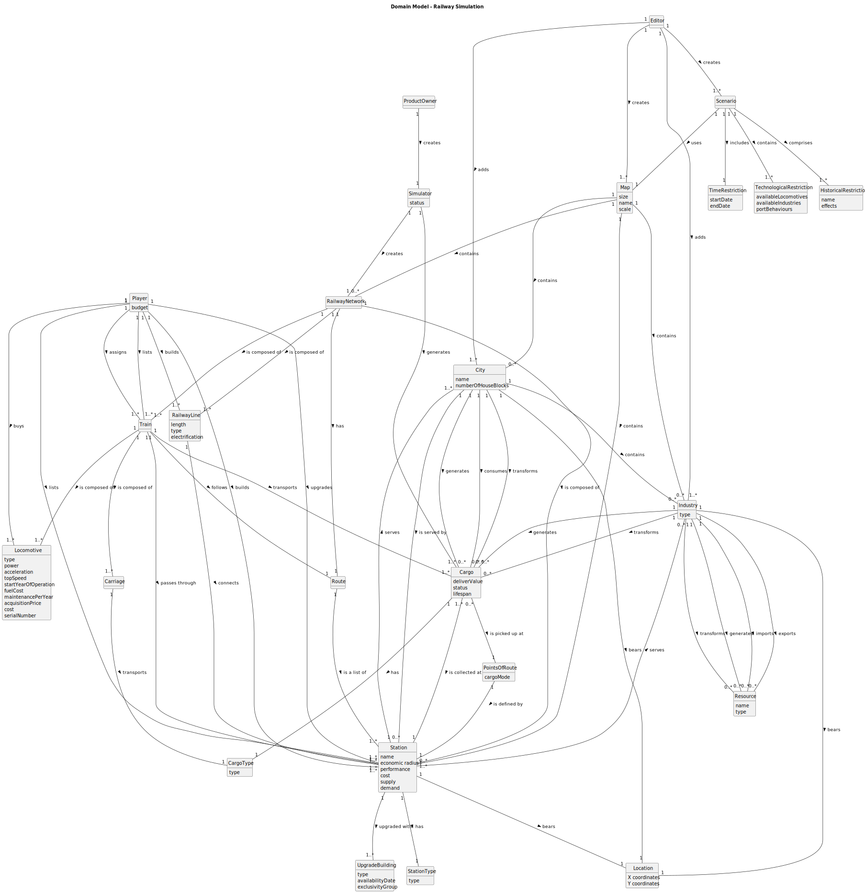

# OO Analysis

The construction process of the domain model is based on the client specifications, especially the nouns (for _concepts_) and verbs (for _relations_) used.

## Rationale to identify domain conceptual classes
To identify domain conceptual classes, start by making a list of candidate conceptual classes inspired by the list of categories suggested in the book "Applying UML and Patterns: An Introduction to Object-Oriented Analysis and Design and Iterative Development".

### _Conceptual Class Category List_

**Business Transactions**

* 

---

**Transaction Line Items**

* 

---

**Product/Service related to a Transaction or Transaction Line Item**

* 

---

**Transaction Records**

* 

---  

**Roles of People or Organizations**

* Product Owner
* Editor
* Player
---

**Places**

* City
* Location

---

**Noteworthy Events**

* 

---

**Physical Objects**

* Train
* Carriage
* Locomotive
* Railway Line

---

**Descriptions of Things**

* ScenarioEditor

---

**Catalogs**

* IndustryType
* ResourceType
* CargoType

---

**Containers**

* Map
* Train
* Industry
* City
* Carriage
* Railway Network
* Scenario

---

**Elements of Containers**

* Cargo
* Resource
* Route
* Locomotive
* Carriage

---

**Organizations**

* 

---

**Other External/Collaborating Systems**

* 

---

**Records of finance, work, contracts, legal matters**

* 

---

**Financial Instruments**

* 

---

**Documents mentioned/used to perform some work/**

* 

---

## Rationale to identify associations between conceptual classes

An association is a relationship between instances of objects that indicates a relevant connection and that is worth of remembering, or it is derivable from the List of Common Associations:

- **_A_** is physically or logically part of **_B_**
- **_A_** is physically or logically contained in/on **_B_**
- **_A_** is a description for **_B_**
- **_A_** known/logged/recorded/reported/captured in **_B_**
- **_A_** uses or manages or owns **_B_**
- **_A_** is related with a transaction (item) of **_B_**
- etc.

| Concept (A)    |             Association              |     Concept (B) |
|----------------|:------------------------------------:|----------------:|
| Editor         |               creates                |             Map |
| Editor         |               creates                |        Scenario |
| Editor         |                 adds                 |        Industry |
| Editor         |                 adds                 |            City |
| Player         |        builds/upgrades/lists         |         Station |
| Player         |                builds                |     RailwayLine |
| Player         |                 buys                 |      Locomotive |
| Player         |            assigns/lists             |           Train |
| ProductOwner   |               creates                |       Simulator |
| Map            |               contains               |            City |
| Map            |               contains               |  RailwayNetwork |
| Map            |            can be used in            |        Scenario |
| Map            |               contains               |         Station |
| Map            |               contains               |        Industry |
| City           |               bears a                |        Location |
| Industry       |               bears a                |        Location |
| Station        |               bears a                |        Location |
| City           |               contains               |         Station |
| City           |               contains               |        Industry |
| Industry       | generates/transforms/imports/exports |        Resource |
| Simulator      |               creates                |  RailwayNetwork |
| RailwayNetwork |            is composed of            |         Station |
| Station        |                serves                |            City |
| Station        |                serves                |        Industry |
| RailwayNetwork |            is composed of            |     RailwayLine |
| RailwayNetwork |                 has                  |           Route |
| Cargo          |     available to be collected at     |         Station |
| Cargo          |                 has                  |       CargoType |
| City           |         generates/transforms         |           Cargo |
| Industry       |         generates/transforms         |           Cargo |
| Station        |         can be upgraded with         | UpgradeBuilding |
| Train          |            is composed of            |      Locomotive |
| Train          |            is composed of            |        Carriage |
| Carriage       |              transports              |           Cargo |
| Route          |             is a list of             |         Station |

## Domain Model

**Do NOT forget to identify concept atributes too.**

**Insert below the Domain Model Diagram in a SVG format**

