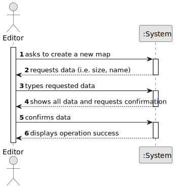

# US006 - Create a Task

## 1. Requirements Engineering

### 1.1. User Story Description

As an Editor, I want to create a map with a size and a name.

### 1.2. Customer Specifications and Clarifications 

**From the specifications document:**

>	The Map Editor allows you to create rectangular maps.

**From the client clarifications:**

> **Question:** Which is the unit of measurement used to estimate duration?

> **Answer:** Duration is estimated in days.

> **Question:** Monetary data is expressed in any particular currency?

> **Answer:** Monetary data (e.g. estimated cost of a task) is indicated in POT (virtual currency internal to the platform).

### 1.3. Acceptance Criteria

* **AC1:** All required fields must be filled in.

### 1.4. Found out Dependencies

* No dependencies found.

### 1.5 Input and Output Data

**Input Data:**

* Typed data:
 *  a size
 *  a name (String)
	
* Selected data:
   

**Output Data:**

 * (In)Success of the operation
 * Stored Map in a list, to be selected later

### 1.6. System Sequence Diagram (SSD)

**_Other alternatives might exist._**

### 1.7 Other Relevant Remarks

* The created task stays in a "not published" state in order to distinguish from "published" tasks.