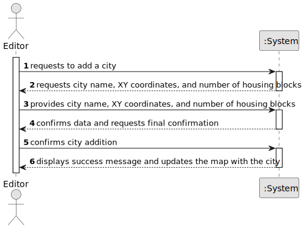

# US006 - Create a Task

## 1. Requirements Engineering

### 1.1. User Story Description

As an Editor, I want to add a city in a position XY of the selected map, with a name and a positive number of house blocks.

### 1.2. Customer Specifications and Clarifications 

**From the specifications document:**

>	A city bears a name, a location (with XY coordinates on the map), and a set of blocks that represent housing.

>  Cities generate and consume passengers and mail, but they also consume final products (e.g., food, textiles, cars).

**From the client clarifications:**

### 1.3. Acceptance Criteria

* **AC1**: A city name cannot have special characters or digits.
* **AC2**: The house blocks can be assigned manually or automatically (randomly around the city tag position accordingly to normal distribution).

### 1.4. Found out Dependencies

* There is a dependency on "US01 - Create a map" as a city must be placed on an existing map

### 1.5 Input and Output Data

**Input Data:**

* Typed data:
  * city name;
  * XY coordinates;
  * number of house blocks;

	
* Selected data:
    

**Output Data:**

* Map displaying the new city.

### 1.6. System Sequence Diagram (SSD)

**_Other alternatives might exist._**

