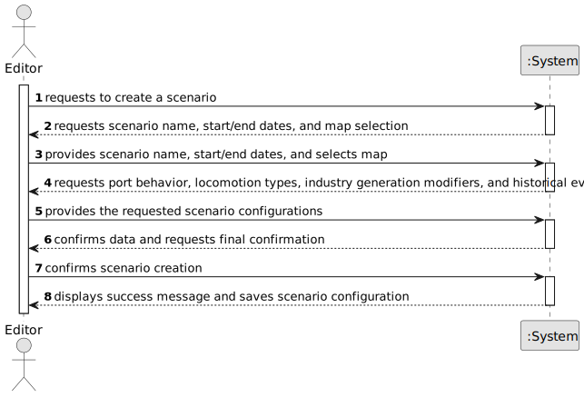

# US006 - Create a Task

## 1. Requirements Engineering

### 1.1. User Story Description

As an Editor, I want to create a scenario for a selected map.

### 1.2. Customer Specifications and Clarifications

**From the specifications document:**

>	The Scenario Editor must allow the user to define the restrictions and conditions for using a given map.

**From the client clarifications:**

> **Question:** Which is the unit of measurement used to estimate duration?
>
> **Answer:** Duration is estimated in days.

> **Question:** Monetary data is expressed in any particular currency?
>
> **Answer:** Monetary data (e.g. estimated cost of a task) is indicated in POT (virtual currency internal to the platform).

### 1.3. Acceptance Criteria

* **AC1**: Definition of the behaviour of ports, which cargoes they import/export and/or transform;
* **AC2**: Definition of the available locomotion types (steam, diesel, and/or electric).
* **AC3**: (Re)Definition of the factors that alter the generation (frequency) of generating industries.
### 1.4. Found out Dependencies

* There is a dependency on "US01 - Create a map" as a scenario must be based on an existing map.

* There is a dependency on "US02 - Add an Industry" and "US03 - Add a City to the Map" since scenarios involve these elements.

### 1.5 Input and Output Data

**Input Data:**

* Typed data:
  * scenario name
  * start and end dates

* Selected data:
  * map;
  * cities and industries;
  * port behavior;
  * locomotion types;
  * industry generation modifiers;
  * historical events;

**Output Data:**

* Scenario configuration file
* Scenario details display

### 1.6. System Sequence Diagram (SSD)

**_Other alternatives might exist._**

### 1.7 Other Relevant Remarks

* The created task stays in a "not published" state in order to distinguish from "published" tasks.