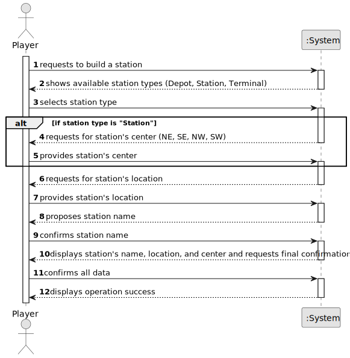

# US005 - Build a Station

## 1. Requirements Engineering

### 1.1. User Story Description

As a Player, I want to build a station (can be a depot, a station, or a terminal) with a location in the current map. The system should propose a name for the station based on the closest city and the station type (e.g., Porto Terminal, Ovar Station, or Silvalde Depot). In the case of Depot and Terminal, the center is the geometric one; in the case of a station, the center should be defined by the Player (NE, SE, NW, SW).

### 1.2. Customer Specifications and Clarifications

**From the specifications document:**

- The player selects the type of station (Depot, Station, Terminal) and its location on the map.
- The system proposes a name for the station based on the closest city and the station type.
- For depots and terminals, the center is automatically chosen by the system as the geometric center.
- For stations, the player must select the center (NE, SE, NW, SW).

**From the client clarifications:**

> **Question:** What is the input data for the user story 5? Is there any input besides the type of the station?
>
> **Answer:** Position; Station type (Terminal, Station or Depot) and, in the case of the station, the center must be filled in. If the proposed is not accepted an alternative one must be entered.
> 
> **Question:** If overbuilding occurs, the program stops running and the game ends or simply gives an error message and asks again for the station construction place?
> 
> **Answer:** Overbuilding in the Editor is possible, the existing building is replaced for the new one;
> 
> **Question:** Should users have options to select different station types (Depot, Station, Terminal) based on the game rules?
> 
> **Answer:** No, a player can build depots, stations and terminal as far he have available budget and there no overbuilding.
> 
> **Question:** Is the budget the only concern to build a station, or does the player also needs to have other specific resources, like steel, etc.? Are resources included on the budget, or the budget represent only the player's monetary value?
> 
> **Answer:**
just the budget in a generic currency.

### 1.3. Acceptance Criteria

* **AC1:** Overbuilding is not possible (i.e., a station cannot be built on top of another station).
* **AC2:** The system must allow the player to select the type of station (Depot, Station, Terminal) and its location on the map.
* **AC3:** For stations, the player must select the center (NE, SE, NW, SW). 
* **AC4:** The system must propose a name for the station based on the closest city and the station type.
* **AC5:** If the player rejects the proposed name, the system must allow the player to enter an alternative name.
* **AC6:** The system must register the alternative name provided by the player.

### 1.4. Found out Dependencies

* **US01:** As an Editor, I want to create a map with a size and a name. 
   - It's necessary to have a map to build a station.
  

* **US03:** As an Editor, I want to add a city in a position XY of the selected map, with a name and a positive number of house blocks.
    - The station name should be based on the closest city.

* **US04:** As an Editor, I want to create a scenario for a selected map.
    - The station should be built in a scenario.

### 1.5 Input and Output Data

**Input Data:**

Typed data:
 * Location on the map

Selected data:
 * Station type (Depot, Station, Terminal)
 * Center definition for the station (NE, SE, NW, SW) if the station type is "Station"

**Output Data:**

- Proposed station's name, location and center
- Success message of the operation

### 1.6. System Sequence Diagram (SSD)

### 1.7 Other Relevant Remarks

* N/A