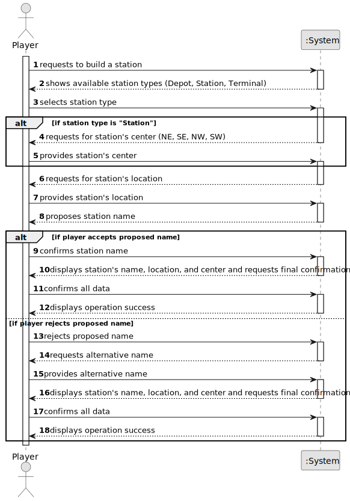

# US005 - Build a Station

## 1. Requirements Engineering

### 1.1. User Story Description

As a Player, I want to build a station (can be a depot, a station, or a terminal) with a location in the current map. The system should propose a name for the station based on the closest city and the station type (e.g., Porto Terminal, Ovar Station, or Silvalde Depot). In the case of Depot and Terminal, the center is the geometric one; in the case of a station, the center should be defined by the Player (NE, SE, NW, SW).

### 1.2. Customer Specifications and Clarifications

**From the specifications document:**

- The player selects the type of station (Depot, Station, Terminal) and its location on the map.
- The system proposes a name for the station based on the closest city and the station type.
- For depots and terminals, the center is automatically chosen by the system as the geometric center.
- For stations, the player must select the center (NE, SE, NW, SW).

**From the client clarifications:**

> **Question:** 
>
> **Answer:** 

### 1.3. Acceptance Criteria

* **AC1:** Overbuilding is not possible (i.e., a station cannot be built on top of another station).

### 1.4. Found out Dependencies

* **US01:** As an Editor, I want to create a map with a size and a name. 
   - It's necessary to have a map to build a station.
  

* **US03:** As an Editor, I want to add a city in a position XY of the selected map, with a name and a positive number of house blocks.
    - The station name should be based on the closest city.

* **US04:** As an Editor, I want to create a scenario for a selected map.
    - The station should be built in a scenario.

### 1.5 Input and Output Data

**Input Data:**

- Selected station type (Depot, Station, Terminal)
- Location on the map
- Center definition for the station (NE, SE, NW, SW) if the station type is "Station"

**Output Data:**

- Proposed station's name, location and center
- Success message of the operation

### 1.6. System Sequence Diagram (SSD)

### 1.7 Other Relevant Remarks

* N/A