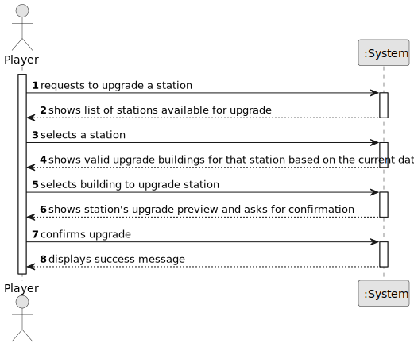

# US006 - Upgrade a Station

## 1. Requirements Engineering

### 1.1. User Story Description

As a Player, I want to upgrade a selected station with a building.
Each type of station improvement has a date from which it is available.
Some equipments are mutually exclusive (e.g., small and grand hotel)
and some equipments/buildings replace others (the telegraph was initially used to facilitate the operation of trains at stations, and was later
replaced by the telephone, so after the advent of telephone, telegraph
is no more available).

### 1.2. Customer Specifications and Clarifications 

**From the specifications document:**

> Each type of station improvement has a date from which it is available.
> Some equipments are mutually exclusive (e.g., small and grand hotel).
> Some equipments/buildings replace others (the telegraph was initially used to facilitate the operation of trains at stations, and was later replaced by the telephone, so after the advent of telephone, telegraph is no more available).

**From the client clarifications:**

> **Question:** Is there a limit on the number of buildings a station can be upgraded with?
>
> **Answer:** No.

> **Question:** Does the upgrade from telegraph to telephone occur automatically once a certain year is reached?
>
> **Answer:** There are no automatic updates; When a new building is available, the player can buy it and then the previous building is replaced.

> **Question:** In the statement, the example of the small hotel and large hotel is given as mutually exclusive equipment. Does this mean that all upgrades of the same type are always mutually exclusive? Or, for example, is it possible to have more than one unit of liquid storage at the same station?
>
> **Answer:** There are mutually exclusive buildings such as a small restaurant and a large restaurant.

> **Question:** Additionally, I would like to confirm if it is possible to have multiple buildings of different types at the same station. For example, can we have a small café, a large hotel, and a post office simultaneously?
>
> **Answer:** There are buildings that, once they exist, make it impossible to construct the previous one. For example, the telegraph was replaced by the telephone. Stations that have a telegraph will continue to have it functioning until a telephone is built to replace the telegraph. From the moment the telephone exists, it is no longer possible to construct a telegraph.

> **Question:** If allowed, is there a maximum limit to the number of buildings at each station?
>
> **Answer:** Multiple identical buildings cannot exist (for example, you cannot have 3 grain silos).

> **Question:** If this limit exists, does it vary according to the type of station (Depot, Station, or Terminal)?
>
> **Answer:** All combinations, as long as they respect the previously mentioned restrictions, are possible.

### 1.3. Acceptance Criteria

* **AC1:** The system must show a list of stations available for upgrade.
* **AC2:** The system must show valid upgrade buildings for the selected station based on the current date.
* **AC3:** The system must prevent mutually exclusive upgrades from being applied simultaneously.
* **AC4:** The system must allow the player to replace old building with a new one, bearing in mind that there are no automatic updates.

### 1.4. Found out Dependencies

* **US05:** As a Player, I want to build a station (can be a depot, a station, or a terminal) with a location in the current map.
  - It's necessary to have an existing station to upgrade.

### 1.5 Input and Output Data

**Input Data:**

* Selected data:
  * a station
  * an upgrade building

**Output Data:**

* Station's upgrade preview
* Success of the operation

### 1.6. System Sequence Diagram (SSD)

**_Other alternatives might exist._**

### 1.7 Other Relevant Remarks

* N/A