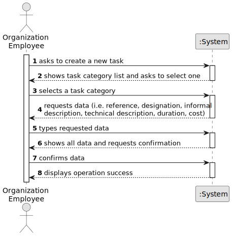

# US006 - Create a Task

## 1. Requirements Engineering

### 1.1. User Story Description

As a Product Owner, I want to create a simulator that generates cargoes at current stations automatically, considering the cities and industries that the railway network serves. The simulator should provide options for start/pause.

### 1.2. Customer Specifications and Clarifications 

**From the specifications document:**

>	The simulator must identify all existing stations in the railway network, determine the supply and demand cargoes based on nearby cities and industries, and generate the corresponding cargoes at those stations.

>	Only stations associated with valid cities and industries are eligible for cargo generation.

>   The simulation operation includes start and pause functionalities and should provide feedback on the simulation status.

**From the client clarifications:**

### 1.3. Acceptance Criteria

* **AC1**: A scenario must be selected from the list of available scenarios before the simulation can be created.

* **AC2**: The system must automatically generate cargoes at stations based on the validated supply/demand of nearby cities and industries.

* **AC3**: The simulation must include "start" and "pause" options, with feedback on the current state.

### 1.4. Found out Dependencies

* There is a dependency on having stations, cities, and industries already defined in the selected scenario.

* Requires validated data models for cities, industries, and station coverage logic.

### 1.5 Input and Output Data

**Input Data:**

* Selected scenario;
* Simulation control command (start/pause)

* Typed data:
    * Control command (start or pause);
	
* Selected data:
    * A scenario from the available scenario list; 

**Output Data:**

* List of available scenarios

* Confirmation of cargo generation logic (pre-execution summary)

* Simulation execution status (started/paused)

### 1.6. System Sequence Diagram (SSD)

**_Other alternatives might exist._**

