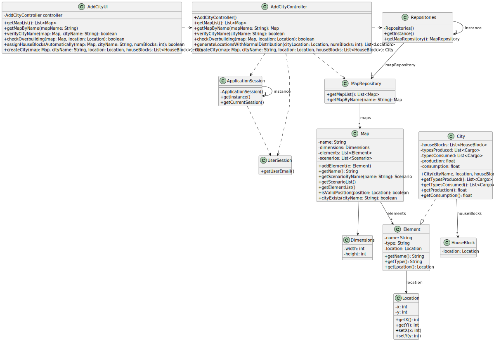

# US003 - Add a city

## 3. Design

### 3.1. Rationale

| Interaction ID | Question: Which class is responsible for...            | Answer               | Justification (with patterns)                                                                                 |
|:---------------|:-------------------------------------------------------|:---------------------|:--------------------------------------------------------------------------------------------------------------|
| Step 1         | ... interacting with the actor?                        | CreateCityUI         | Pure Fabrication: there is no reason to assign this responsibility to any existing class in the Domain Model. |
|                | ... coordinating the US?                               | CreateCityController | Controller                                                                                                    |
|                | ... knowing the user using the system?                 | UserSession          | IE: cf. A&A component documentation.                                                                          |
|                | ... obtaining the map list?                            |                      | IE: is responsible for user interactions.                                                                     |
| Step 2         | ... knowing all existing maps to show?                 | Repositories         | IE: Repositories maintains Maps.                                                                              |
|                |                                                        | MapRepository        | By applying High Cohesion (HC) + Low Coupling (LC) on class Repositories, it delegates the responsibility.    |
|                | ... showing the map list?                              | CreateCityUI         | IE: is responsible for user interactions.                                                                     |
| Step 3         | ... saving the selected map?                           | CreateCityUI         | IE: is responsible for keeping the selected category.                                                         |
| Step 4         | ... requesting city name?                              | CreateCityUI         | IE: is responsible for user interactions.                                                                     |
|                | ... verifying if a city with same name already exists? | CreateCityController | IE: controller performs coordination and check logic.                                                         |
|                | ... retrieving map by name?                            | MapRepository        | IE: owns knowledge of the maps.                                                                               |
|                | ... checking if a city exists in a list of elements?   | CreateCityController | IE: has list of elements, knows search condition.                                                             |
| Step 5         | ... saving city name?                                  | CreateCityUI         | IE: is responsible for user interactions.                                                                     |
|                | ... showing warning to user if city already exists?    | CreateCityUI         | IE: is responsible for UI logic and feedback to the user.                                                     |
| Step 6         | ... requesting city position (X,Y coordinates)?        | CreateCityUI         | IE: is responsible for user interactions.                                                                     |
|                | ... verifying if the given city position is valid?     | CreateCityController | IE: performs validation based on map dimensions.                                                              |
|                | ... retrieving map dimensions?                         | Map                  | IE: owns its own dimensions.                                                                                  |
| Step 7         | ... saving city position (X,Y coordinates)?            | CreateCityUI         | IE: is responsible for keeping the inputted data.                                                             |
| Step 8         | ... showing manual/automatic block assignment option?  | CreateCityUI         | IE: is responsible for user interactions.                                                                     |
| Step 9         | ... assigning house blocks manually?                   | CreateCityController | IE: controller performs coordination and check logic.                                                         |
|                | ... assigning house blocks automatically?              | CreateCityController | IE: controller performs coordination and check logic.                                                         |
| Step 10        | ... showing all data and requesting confirmation?      | CreateCityUI         | IE: is responsible for user interactions.                                                                     |
| Step 11        | ... creating a new City object?                        | Map                  | Creator: Map aggregates elements and can create new ones (Rule 1 of Creator).                                 |
|                | ... saving the City?                                   | Map                  | IE: Map contains its own list of elements, can add a new one.                                                 |
| Step 12        | ... informing operation success?                       | CreateCityUI         | IE: is responsible for user interactions.                                                                     |

### Systematization ##

According to the taken rationale, the conceptual classes promoted to software classes are:

* Map
* Element (superclass, not directly instantiated)
* City
* HouseBlock
* Location

Other software classes (i.e. Pure Fabrication) identified:

* CreateCityUI
* CreateCityController
* Repositories
* MapRepository
* ApplicationSession
* UserSession

## 3.2. Sequence Diagram (SD)

### Full Diagram

This diagram shows the full sequence of interactions between the classes involved in the realization of this user story.

## 3.3. Class Diagram (CD)

