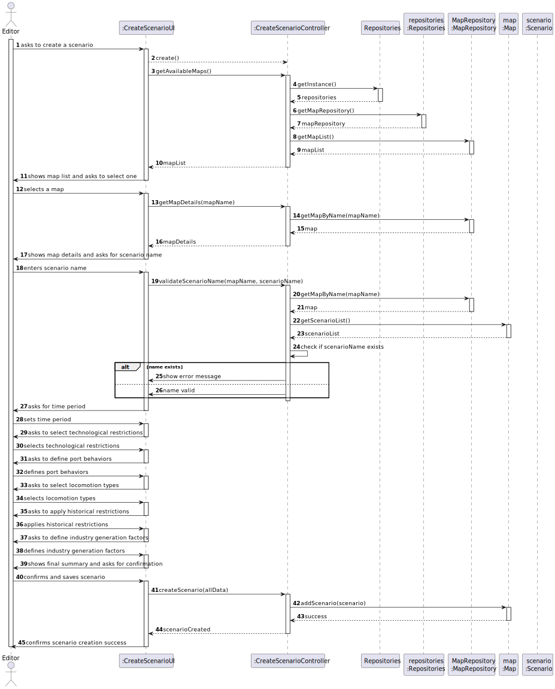
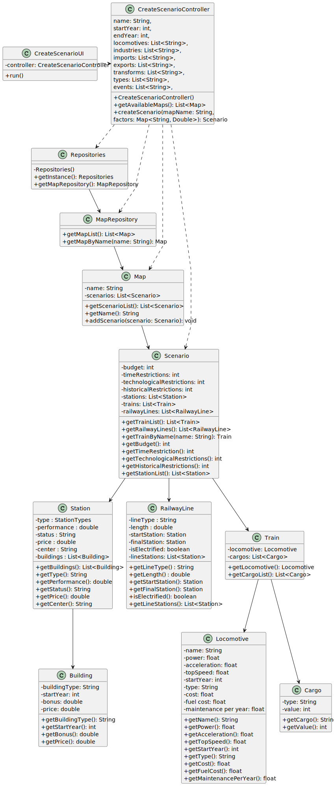

### Rationale Table for US004 – Create Scenario

| Interaction ID | Question: Which class is responsible for...                             | Answer                     | Justification (with patterns)                                                                                                 |
|----------------|-------------------------------------------------------------------------|----------------------------|------------------------------------------------------------------------------------------------------------------------------|
| Step 1         | ... interacting with the actor?                                          | CreateScenarioUI           | **Pure Fabrication**: não pertence ao modelo de domínio e é necessária para gerir a interface com o utilizador.              |
|                | ... coordenar a execução da US?                                          | CreateScenarioController   | **Controller**: coordena o fluxo da criação de cenários e orquestra chamadas para o domínio e repositórios.                 |
| Step 2         | ... conhecer os mapas existentes?                                        | MapRepository              | **Information Expert**: detém os dados dos mapas; responsável por `getMapList()`.                                           |
|                |                                                                         | Repositories               | **HC + LC**: encapsula o acesso a vários repositórios especializados.                                                        |
| Step 3         | ... verificar se o nome do cenário é válido?                            | Map                        | **IE**: contém a lista de `Scenario`, conhece os nomes dos existentes e pode verificar duplicações.                         |
| Step 4         | ... manter temporariamente os dados do novo cenário antes da criação?   | CreateScenarioUI           | **IE**: responsável pela recolha sequencial dos dados do utilizador.                                                        |
| Step 5         | ... instanciar o novo cenário?                                           | CreateScenarioController   | **Creator (Rule 3)**: possui os dados necessários e encapsula a criação baseada nos inputs da UI.                           |
| Step 6         | ... validar os dados do cenário (restrições, anos, tipos)?              | CreateScenarioController   | **IE**: validações simples delegadas ao controller antes de persistir o cenário.                                            |
| Step 7         | ... guardar o novo cenário no mapa?                                      | Map                        | **Creator (Rule 1)**: o `Map` contém uma lista de `Scenario`, logo deve criar/adicionar o novo cenário.                     |
| Step 8         | ... confirmar o sucesso da operação ao utilizador?                      | CreateScenarioUI           | **IE**: gere as mensagens finais e comunicação com o ator.                                                                  |

---

### Systematization

According to the taken rationale, the conceptual classes promoted to software classes are:
- Map
- Scenario

Other software classes (i.e. Pure Fabrication) identified:
- CreateScenarioUI
- CreateScenarioController
- Repositories
- MapRepository

## 3.2. Sequence Diagram (SD)

### Full Diagram

This diagram shows the full sequence of interactions between the classes involved in the realization of this user story.

## 3.3. Class Diagram (CD)

