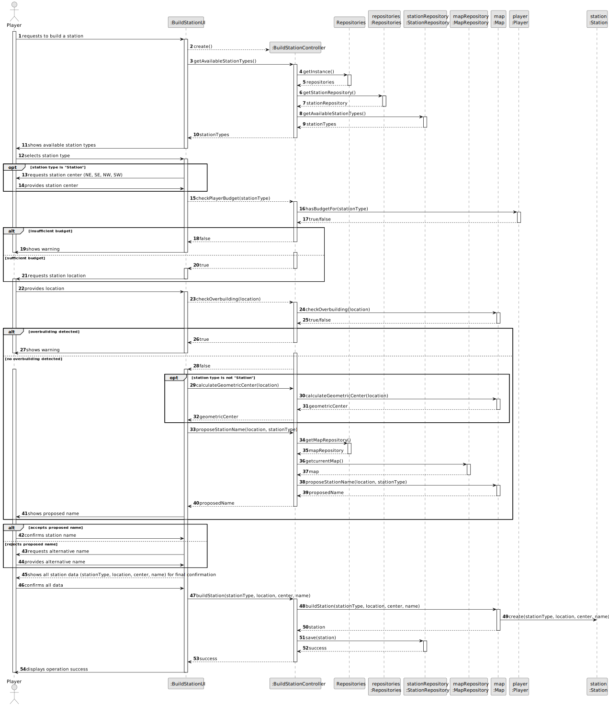
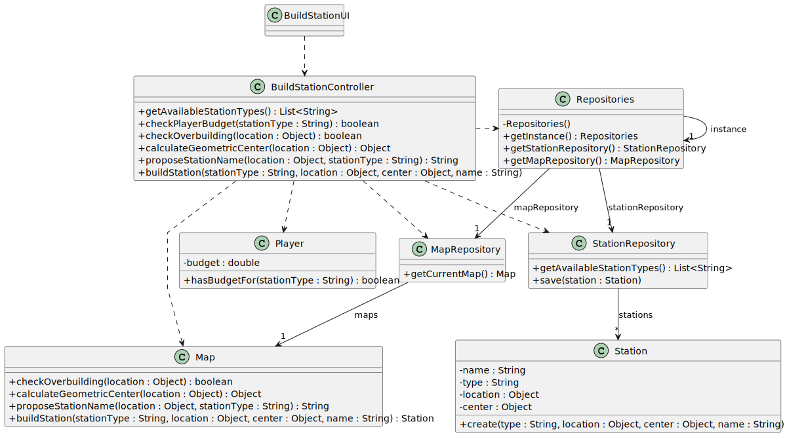

# US005 - Build a Station

## 3. Design

### 3.1. Rationale

| Interaction ID | Question: Which class is responsible for... | Answer                 | Justification (with patterns)                                                                        |
|:---------------|:--------------------------------------------|:-----------------------|:-----------------------------------------------------------------------------------------------------|
| Step 1         | ... interacting with the actor?             | BuildStationUI         | Pure Fabrication: there is no reason to assign this responsibility to any class in the Domain Model. |
|                | ... coordinating the US?                    | BuildStationController | Controller: coordinates the interactions between UI, repositories, and entities.                     |
|                | ... knowing the player?                     | Player                 | IE: Player knows its own budget and can check if it is sufficient.                                   |
| Step 2         | ... knowing the available station types?    | Repositories           | IE: Repositories maintains the StationRepository.                                                    |
|                |                                             | StationRepository      | High Cohesion + Low Coupling: delegates to StationRepository, which manages station types.           |
| Step 3         | ... checking the player's budget?           | Player                 | IE: Player knows its own budget and can validate it.                                                 |
| Step 4         | ... checking overbuilding?                  | Map                    | IE: Map knows the current state and locations, so it can check for overbuilding.                     |
| Step 5         | ... calculating the geometric center?       | Map                    | IE: Map knows its own geometry and can calculate the geometric center.                               |
| Step 6         | ... proposing the station name?             | Map                    | IE: Map knows all existing stations and can suggest a name based on context.                         |
| Step 7         | ... creating a new station?                 | Map                    | Creator: Map contains the stations and is responsible for their creation.                            |
| Step 8         | ... saving the created station?             | StationRepository      | IE: StationRepository maintains all stations and is responsible for persisting them.                 |
| Step 9         | ... informing operation success?            | BuildStationUI         | IE: responsible for interacting with the player and displaying success or error messages.            |

### Systematization ##

According to the taken rationale, the conceptual classes promoted to software classes are:

* Player
* Map
* Station

Other software classes (i.e. Pure Fabrication, Controller) identified:

* BuildStationUI
* BuildStationController
* Repositories
* StationRepository
* MapRepository

## 3.2. Sequence Diagram (SD)

### Full Diagram

This diagram shows the full sequence of interactions between the classes involved in the realization of this user story.

## 3.3. Class Diagram (CD)

