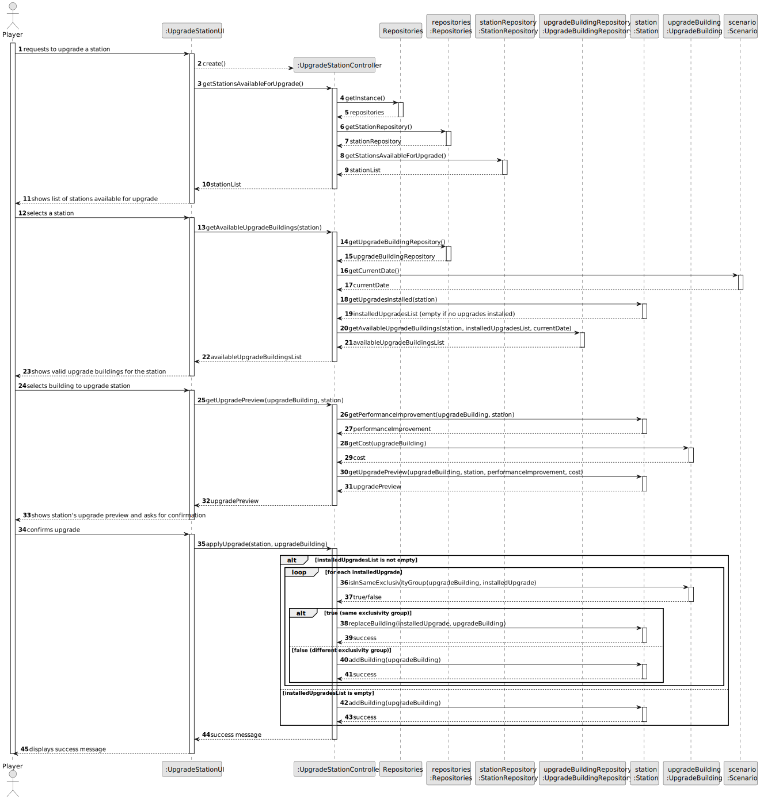
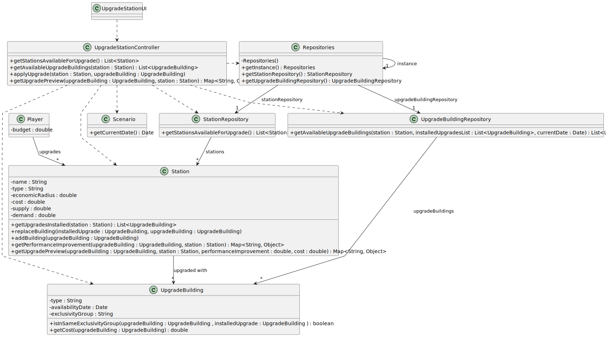

# US006 - Upgrade a Station

## 3. Design

### 3.1. Rationale

| Interaction ID | Question: Which class is responsible for...                         | Answer                    | Justification (with patterns)                                                                                               |
|:---------------|:--------------------------------------------------------------------|:--------------------------|:----------------------------------------------------------------------------------------------------------------------------|
| Step 1         | ... interacting with the actor?                                     | UpgradeStationUI          | Pure Fabrication: there is no reason to assign this responsibility to any class in the Domain Model.                        |
|                | ... coordinating the US?                                            | UpgradeStationController  | Controller: coordinates the interactions between UI, repositories, and entities.                                            |
| Step 2         | ... knowing the stations available for upgrade?                     | Repositories              | IE: Repositories maintains the StationRepository.                                                                           |
|                |                                                                     | StationRepository         | High Cohesion + Low Coupling: delegates to StationRepository.                                                               |
| Step 3         | ... knowing the buildings available to upgrade the station with?    | Repositories              | IE: Repositories maintains the UpgradeBuildingRepository.                                                                   |
|                |                                                                     | UpgradeBuildingRepository | High Cohesion + Low Coupling: delegates to UpgradeBuildingRepository.                                                       |
| Step 4         | ... obtaining the current date?                                     | Scenario                  | IE: responsible for providing the current scenario date.                                                                    |
| Step 5         | ... generating the upgrade preview?                                 | UpgradeStationController  | Controller: coordinates the retrieval of the necessary data for the preview, aggregating information from several entities. |
|                | ... calculating the performance improvement for the upgrade?        | Station                   | IE: Station knows its own functioning and the impact of upgrades.                                                           |
|                | ... knowing the cost of the upgrade?                                | UpgradeBuilding           | IE: UpgradeBuilding knows its own cost.                                                                                     |
| Step 6         | ... verifying if the upgrade belongs to the same exclusivity group? | UpgradeBuilding           | IE: responsible for verifying if two upgrades belong to the same exclusivity group.                                         |
| Step 7         | ... applying the upgrade to the station?                            | Station                   | IE: responsible for applying the upgrade, as it holds the necessary data.                                                   |
| Step 8         | ... informing the success of the operation?                         | UpgradeStationUI          | IE: responsible for interacting with the player and displaying success or error messages.                                   |

### Systematization ##

According to the taken rationale, the conceptual classes promoted to software classes are: 

* Station
* UpgradeBuilding
* Scenario

Other software classes (i.e. Pure Fabrication, Controller) identified: 

* UpgradeStationUI
* UpgradeStationController
* Repositories
* StationRepository
* UpgradeBuildingRepository

## 3.2. Sequence Diagram (SD)

### Full Diagram

This diagram shows the full sequence of interactions between the classes involved in the realization of this user story.

## 3.3. Class Diagram (CD)

