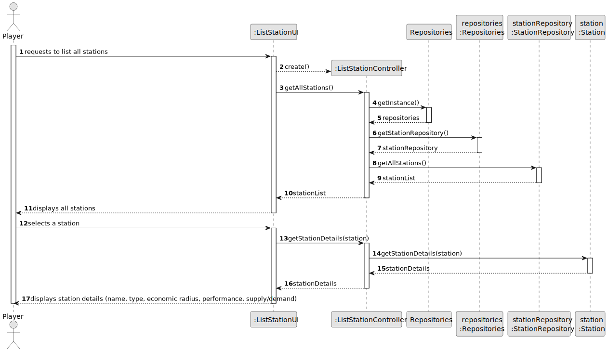
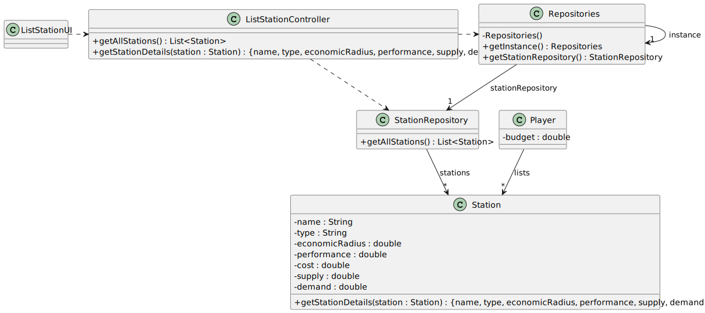

# US007 - List all Stations

## 3. Design

### 3.1. Rationale

| Interaction ID | Question: Which class is responsible for... | Answer                | Justification (with patterns)                                                                                                   |
|:---------------|:--------------------------------------------|:----------------------|:--------------------------------------------------------------------------------------------------------------------------------|
| Step 1         | ... interacting with the actor?             | ListStationUI         | Pure Fabrication: there is no reason to assign this responsibility to any existing class in the Domain Model.                   |
|                | ... coordinating the US?                    | ListStationController | Controller                                                                                                                      |
| Step 2         | ... knowing all existing stations to show?  | Repositories          | IE: Repositories maintains StationRepository.                                                                                   |
|                |                                             | StationRepository     | By applying High Cohesion (HC) + Low Coupling (LC) on class Repositories, it delegates the responsibility to StationRepository. |
| Step 3         | ... retrieving station details?             | Station               | IE: owns its data and is responsible for providing its details.                                                                 |

### Systematization ##

According to the taken rationale, the conceptual classes promoted to software classes are: 

* Station

Other software classes (i.e. Pure Fabrication) identified: 

* ListStationUI
* ListStationController
* Repositories
* StationRepository

## 3.2. Sequence Diagram (SD)

### Full Diagram

This diagram shows the full sequence of interactions between the classes involved in the realization of this user story.

## 3.3. Class Diagram (CD)

