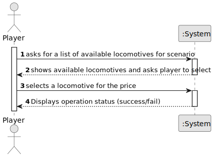

# US009 - Buy a Locomotive

## 1. Requirements Engineering

### 1.1. User Story Description

As a Player, I want to buy a locomotive.

### 1.2. Customer Specifications and Clarifications 

**From the specifications document:**

>	The player should choose the locomotive from a list of available locomotives for the scenario as well as a current date.

**From the client clarifications:**

> **Question:** Is there a limit on how many trains a player can own?
>
> **Answer:** No.

> **Question:** Can a player buy the same train multiple times?
>
> **Answer:** A player can buy the same type of locomotive but not the same one because they all have unique identifiers.

> **Question:** Can a player buy the same train multiple times?
>
> **Answer:** A player can buy the same type of locomotive but not the same one because they all have unique identifiers.

### 1.3. Acceptance Criteria

* **AC1:** The player should choose the locomotive from a list of available locomotives for the scenario as well as a current date.

### 1.4. Found out Dependencies

* There is a dependency on "US04 - As an Editor, I want to create a scenario for a selected map." as there must be a scenario in order to buy a locomotive for a scenario.

### 1.5 Input and Output Data

**Input Data:**

* Typed data:
    * reference to locomotive to purchase
	
* Selected data:
    * a locomotive

**Output Data:**

* List of locomotives available for player
* (In)Success of the operation

### 1.6. System Sequence Diagram (SSD)

**_Other alternatives might exist._**

### 1.7 Other Relevant Remarks

* The player's budget has to be able to purchase the locomotive and reduces its current money.w