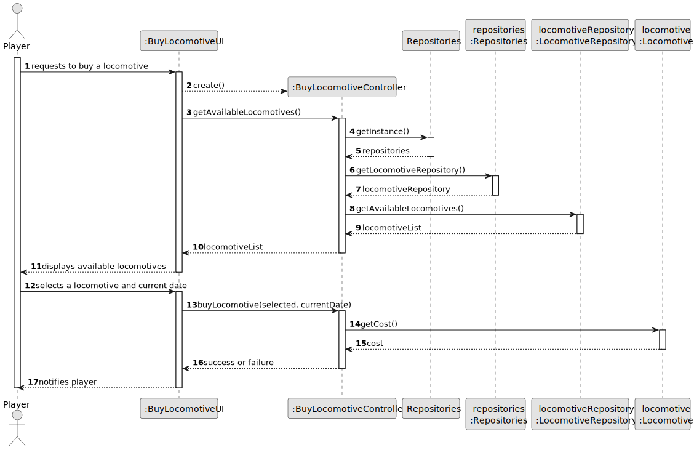
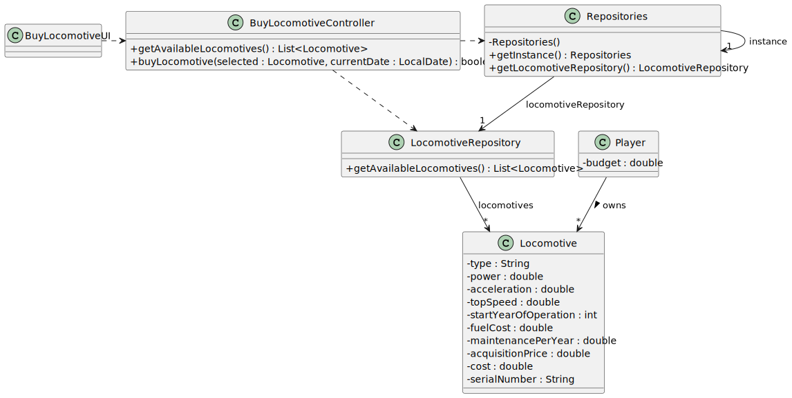

## US009 - Buy a Locomotive

### 3. Design

#### 3.1. Rationale

| Interaction ID | Question: Which class is responsible for...                           | Answer                  | Justification (with patterns)                                                                                                   |
|----------------|----------------------------------------------------------------------|--------------------------|----------------------------------------------------------------------------------------------------------------------------------|
| Step 1         | ... interacting with the actor?                                       | `BuyLocomotiveUI`        | **Pure Fabrication**: there is no reason to assign this responsibility to any domain class.                                     |
|                | ... coordinating the US?                                              | `BuyLocomotiveController`| **Controller**: coordinates user input, business logic, and system interaction.                                                  |
| Step 2         | ... knowing which locomotives are available in the scenario?          | `Repositories`           | **IE**: Provides access to `LocomotiveRepository`.                                                                              |
|                |                                                                      | `LocomotiveRepository`   | **High Cohesion + Low Coupling**: Specializes in locomotive data access while maintaining separation from core logic.           |
| Step 3         | ... storing the locomotive data and price?                            | `Locomotive`             | **IE**: It owns and provides its attributes such as type, cost, and serial number.                                              |
| Step 4         | ... owning the purchased locomotives and budget?                      | `Player`                 | **IE**: The player entity tracks budget and purchased locomotives.                                                              |

#### 3.2. Systematization

According to the rationale, the conceptual classes promoted to software classes are:

- `Locomotive`
- `Player`

Other software classes (**Pure Fabrication**) identified:

- `BuyLocomotiveUI`
- `BuyLocomotiveController`
- `Repositories`
- `LocomotiveRepository`

#### 3.3. Sequence Diagram

This diagram shows the full sequence of interactions involved in this user story:

#### 3.4. Class Diagram

This diagram captures the structure of the classes involved in this use case:

