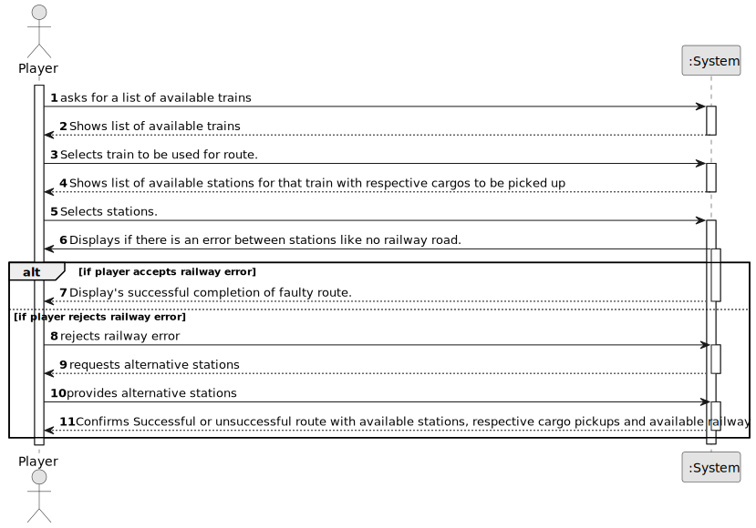

# US010 - Assign a Train to a Route

## 1. Requirements Engineering

### 1.1. User Story Description

As a Player, I want to assign a selected train to a route with valid stations and the respective list of cargoes to be picked up in each station.

### 1.2. Customer Specifications and Clarifications 

**From the specifications document:**

**From the client clarifications:**

> **Question:** Can multiple cargo types be assigned to the same train?
>
> **Answer:** Yes.

> **Question:** Does a route have a limit of stations that can be assigned?
>
> **Answer:** No.

> **Question:** Does a route have a limit of stations that can be assigned?
>
> **Answer:** No.

> **Question:** If there is no path between stations should we create the route?
>
> **Answer:** No. If there is no path between any pair of consecutive points of the route, the player should be warned, then the player can opt between cancel/proceed.

### 1.3. Acceptance Criteria

* **AC1:** Train must be available.
* **AC2:** Stations must be valid.
* **AC3:** Cargo must be valid for that train.

### 1.4. Found out Dependencies

* There is a dependency on "US05 - As a Player, I want to build a station" as there must be at least one available station.
* There is a dependency on "US08 - As a Player, I want to build a railway line between two stations" as there must be available railway lines.

### 1.5 Input and Output Data

**Input Data:**

* Typed data:
    * Reference to train to be selected
    * Reference to stations that should be used in route.
	
* Selected data:
    * Train
    * Stations

**Output Data:**

* List of existing valid stations and their cargo to be picked up.
* List of available trains
* Successful or unsuccessful creation of route.

### 1.6. System Sequence Diagram (SSD)

**_Other alternatives might exist._**

### 1.7 Other Relevant Remarks

* If there is no path between the stations it should warn the player and let him decide how to continue.