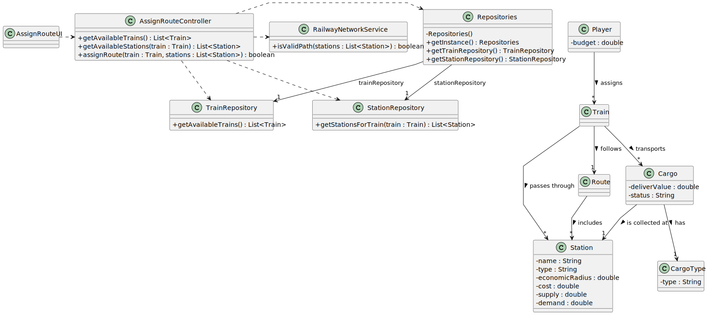

## US010 - Assign a Train to a Route

### 3. Design

#### 3.1. Rationale

| Interaction ID | Question: Which class is responsible for...                                      | Answer                    | Justification (with patterns)                                                                                                   |
|----------------|----------------------------------------------------------------------------------|----------------------------|----------------------------------------------------------------------------------------------------------------------------------|
| Step 1         | ... interacting with the actor?                                                  | `AssignRouteUI`            | **Pure Fabrication**: there is no reason to assign this responsibility to any domain class.                                     |
|                | ... coordinating the US?                                                         | `AssignRouteController`    | **Controller**: orchestrates system behavior, makes calls to repositories, checks conditions, and updates the model.            |
| Step 2         | ... knowing the available trains and stations?                                   | `Repositories`             | **IE**: Provides access to domain-specific repositories.                                                                         |
|                |                                                                                  | `TrainRepository`, `StationRepository` | **High Cohesion + Low Coupling**: Each specializes in managing access to a specific kind of domain object.         |
| Step 3         | ... checking if a valid path exists between stations?                            | `RailwayNetworkService`    | **Pure Fabrication**: Encapsulates the validation logic for railway paths to reduce coupling and centralize domain rules.       |
| Step 4         | ... maintaining route information and structure?                                 | `Route`                    | **IE**: Responsible for holding the list of stations that make up the route.                                                    |
| Step 5         | ... transporting cargo and linking it to stations and types?                     | `Train`, `Cargo`, `CargoType` | **IE**: Each class owns and provides access to its own data (cargo, origin station, type, etc.).                                |

#### 3.2. Systematization

According to the rationale, the conceptual classes promoted to software classes are:

- `Train`
- `Station`
- `Route`
- `Cargo`
- `CargoType`

Other software classes (**Pure Fabrication**) identified:

- `AssignRouteUI`
- `AssignRouteController`
- `Repositories`
- `TrainRepository`
- `StationRepository`
- `RailwayNetworkService`

#### 3.3. Sequence Diagram

This diagram shows the full sequence of interactions involved in this user story:

#### 3.4. Class Diagram

This diagram captures the structure of the classes involved in this use case:

