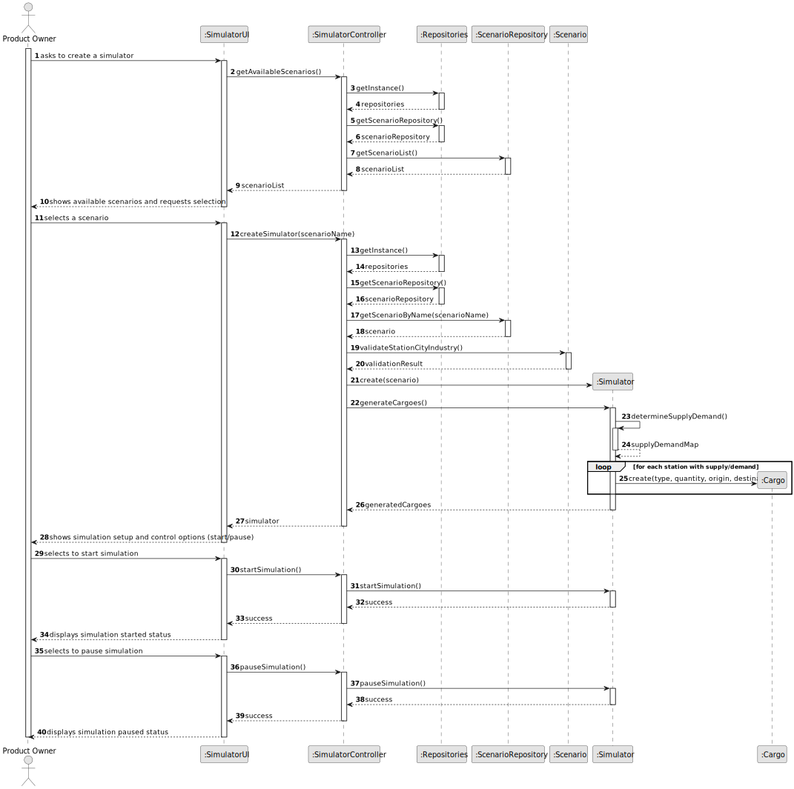
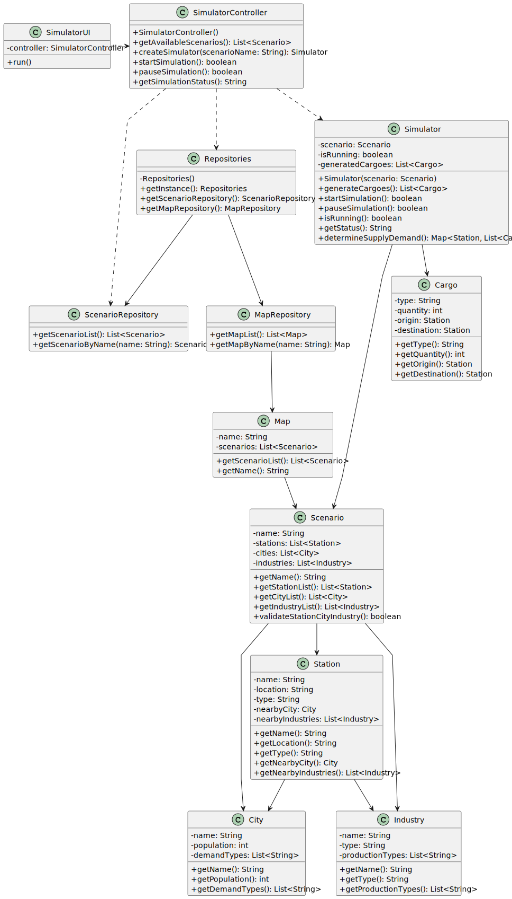

# US012 - Create a Simulator

## 3. Design

### 3.1. Rationale

| Interaction ID | Question: Which class is responsible for...        | Answer                 | Justification (with patterns)                                                                                                       |
|:---------------|:---------------------------------------------------|:-----------------------|:------------------------------------------------------------------------------------------------------------------------------------|
| Step 1         | ... interacting with the actor?                    | SimulatorUI            | Pure Fabrication: there is no reason to assign this responsibility to any existing class in the Domain Model.                       |
|                | ... coordinating the US?                           | SimulatorController    | Controller                                                                                                                          |
| Step 2         | ... requesting scenario selection?                 | SimulatorUI            | IE: is responsible for user interactions.                                                                                           |
|                | ... knowing all available scenarios?               | Repositories           | IE: Repositories maintains Scenarios.                                                                                               |
|                |                                                    | ScenarioRepository     | By applying High Cohesion (HC) + Low Coupling (LC) on class Repositories, it delegates the responsibility on ScenarioRepository.    |
| Step 3         | ... saving the selected scenario?                  | SimulatorUI            | IE: is responsible for keeping the selected scenario.                                                                               |
| Step 4         | ... generating cargoes at stations?                | Simulator              | Creator: responsible for creating and managing cargoes based on cities and industries.                                              |
|                | ... validating cities and industries?              | Scenario               | IE: knows its own cities and industries.                                                                                            |
|                | ... determining supply and demand?                 | Simulator              | IE: contains the logic to determine supply and demand based on cities and industries.                                               |
| Step 5         | ... providing simulation control options?          | SimulatorUI            | IE: is responsible for user interactions.                                                                                           |
| Step 6         | ... starting/pausing the simulation?               | Simulator              | IE: controls the simulation state.                                                                                                  |
| Step 7         | ... providing feedback on simulation status?       | SimulatorUI            | IE: is responsible for user interactions.                                                                                           |

### Systematization ##

According to the taken rationale, the conceptual classes promoted to software classes are: 

* Scenario
* Station
* City
* Industry
* Cargo

Other software classes (i.e. Pure Fabrication) identified: 

* SimulatorUI  
* SimulatorController
* Simulator
* Repositories
* ScenarioRepository
* MapRepository

## 3.2. Sequence Diagram (SD)

### Full Diagram

This diagram shows the full sequence of interactions between the classes involved in the realization of this user story.

## 3.3. Class Diagram (CD)

