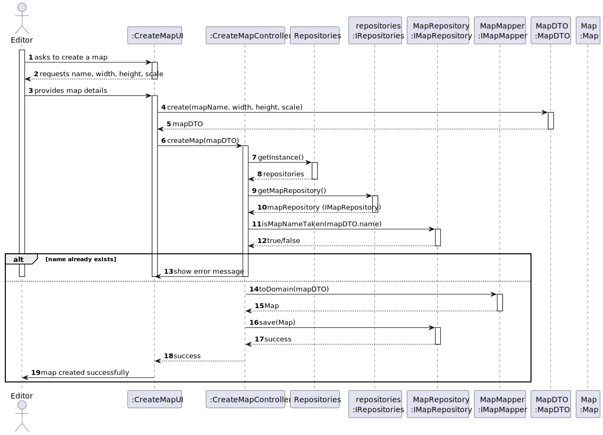
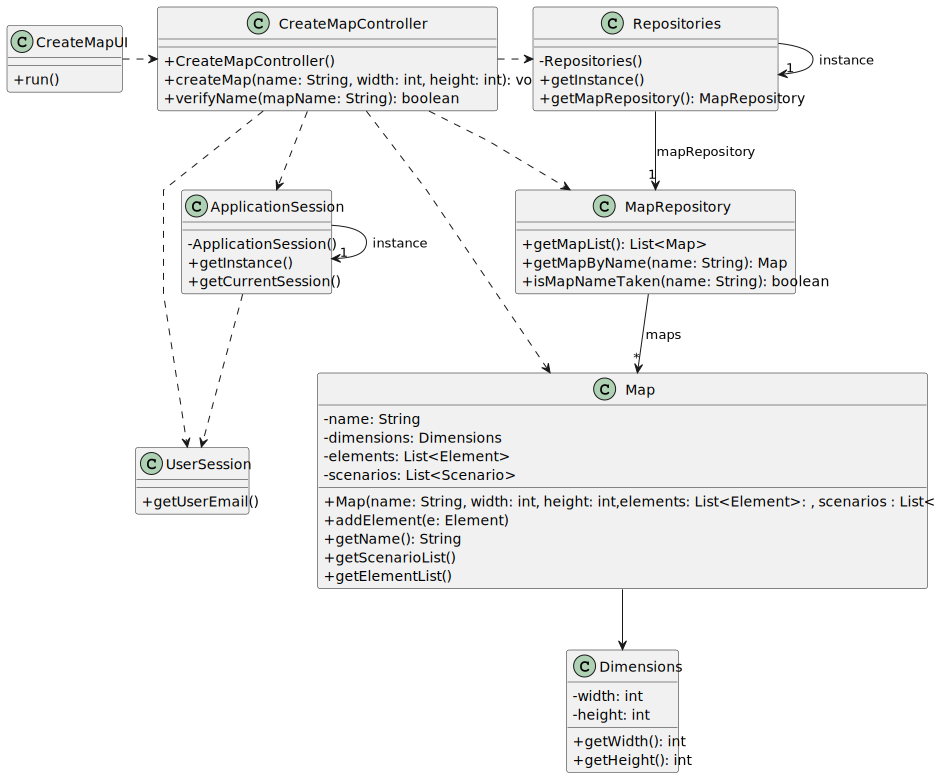

# US001 - Create a Map

## 3. Design

### 3.1. Rationale

| Interaction ID | Question: Which class is responsible for...                    | Answer              | Justification (with patterns)                                                                                     |
|:---------------|:---------------------------------------------------------------|:--------------------|:------------------------------------------------------------------------------------------------------------------|
| Step 1         | ... interacting with the actor?                                | CreateMapUI         | Pure Fabrication: UI layer handles all user interactions.                                                        |
|                | ... coordinating the use case?                                 | CreateMapController | Controller: handles flow and decision logic.                                                                     |
| Step 2         | ... requesting map name and dimensions?                        | CreateMapUI         | IE: UI prompts user for input.                                                                                   |
| Step 3         | ... storing temporary user input?                              | MapDTO              | DTO: encapsulates temporary data transfer from UI to Controller.                                                 |
| Step 4         | ... receiving request to create a map?                         | CreateMapController | Controller: coordinates use case.                                                                                |
| Step 5         | ... accessing repositories?                                    | Repositories         | IE: centralized access to data stores.                                                                           |
|                | ... accessing the map repository specifically?                 | IRepositories        | IE: abstracts over all repositories.                                                                             |
|                | ... checking if a map name already exists?                     | IMapRepository       | IE: responsible for storing and checking map identities.                                                         |
| Step 6         | ... showing error if name exists?                              | CreateMapUI         | IE: UI is responsible for feedback to the user.                                                                  |
| Step 7         | ... converting from DTO to Domain?                             | MapMapper            | PF: separates transformation logic (Protected Variation pattern).                                                |
| Step 8         | ... instantiating the new Map object?                          | MapMapper            | Creator: builds domain object from DTO.                                                                          |
| Step 9         | ... persisting the new map?                                    | IMapRepository       | IE: responsible for saving maps to persistence.                                                                  |
| Step 10        | ... confirming successful creation to controller and UI?       | IMapRepository       | IE: provides operation result.                                                                                   |
| Step 11        | ... returning result to UI?                                    | CreateMapController | Controller: completes coordination.                                                                              |
| Step 12        | ... displaying success to user?                                | CreateMapUI         | IE: UI concludes the use case.                                                                                   |

### Systematization

According to the rationale, the conceptual classes promoted to software classes are:

* Map
* Dimensions

Other software classes (i.e., Pure Fabrication) identified:

* CreateMapUI
* CreateMapController
* MapMapper
* MapDTO
* Repositories
* IRepositories
* IMapRepository

## 3.2. Sequence Diagram (SD)

This diagram shows the full sequence of interactions between the classes involved in the realization of this user story.

## 3.3. Class Diagram (CD)

