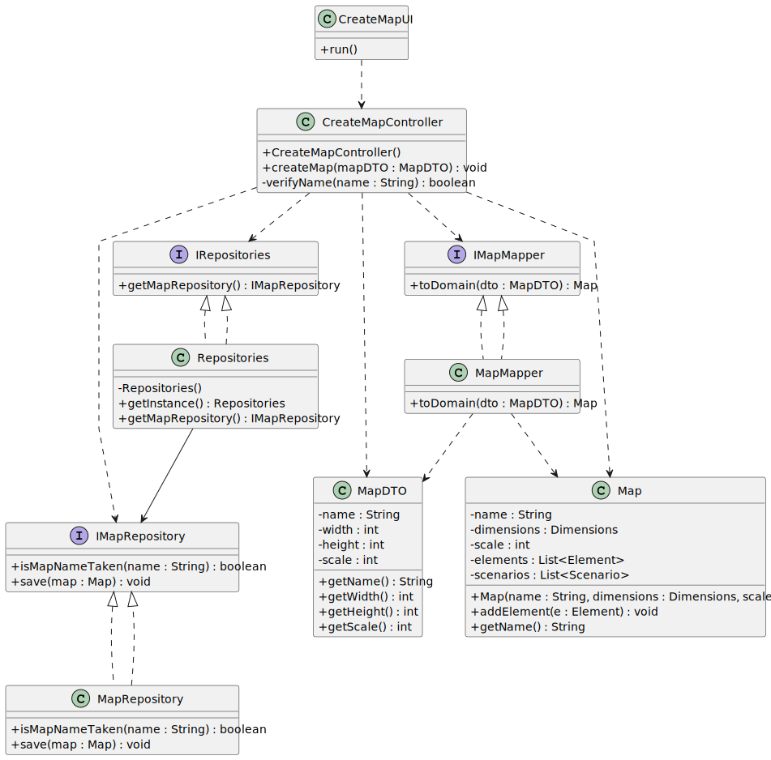

# US001 - Create a Map

## 3. Design

### 3.1. Rationale

| Interaction ID | Question: Which class is responsible for...        | Answer                 | Justification (with patterns)                                                                                                       |
|:---------------|:---------------------------------------------------|:-----------------------|:------------------------------------------------------------------------------------------------------------------------------------|
| Step 1         | ... interacting with the actor?                    | CreateMapUI            | Pure Fabrication: there is no reason to assign this responsibility to any existing class in the Domain Model.                       |
|                | ... coordinating the US?                           | CreateMapController    | Controller                                                                                                                          |
|                | ... knowing the user using the system?             | UserSession            | IE: cf. A&A component documentation.                                                                                                |
| Step 2         | ... requesting map name and dimensions?            | CreateMapUI            | IE: is responsible for user interactions.                                                                                           |
| Step 3         | ... validating the map name?                       | CreateMapController    | IE: controller performs coordination and validation logic.                                                                          |
|                | ... checking if a map name is already taken?       | MapRepository          | IE: owns knowledge of the maps.                                                                                                     |
| Step 4         | ... showing map details and requesting confirmation? | CreateMapUI          | IE: is responsible for user interactions.                                                                                           |
| Step 5         | ... creating a new Map object?                     | CreateMapController    | Creator: controller coordinates the creation process.                                                                               |
|                | ... saving the created map?                        | MapRepository          | IE: owns all maps.                                                                                                                  |
| Step 6         | ... informing operation success?                   | CreateMapUI            | IE: is responsible for user interactions.                                                                                           |

### Systematization ##

According to the taken rationale, the conceptual classes promoted to software classes are: 

* Map
* Dimensions

Other software classes (i.e. Pure Fabrication) identified: 

* CreateMapUI  
* CreateMapController
* Repositories
* MapRepository
* ApplicationSession
* UserSession

## 3.2. Sequence Diagram (SD)

### Full Diagram

This diagram shows the full sequence of interactions between the classes involved in the realization of this user story.

## 3.3. Class Diagram (CD)

