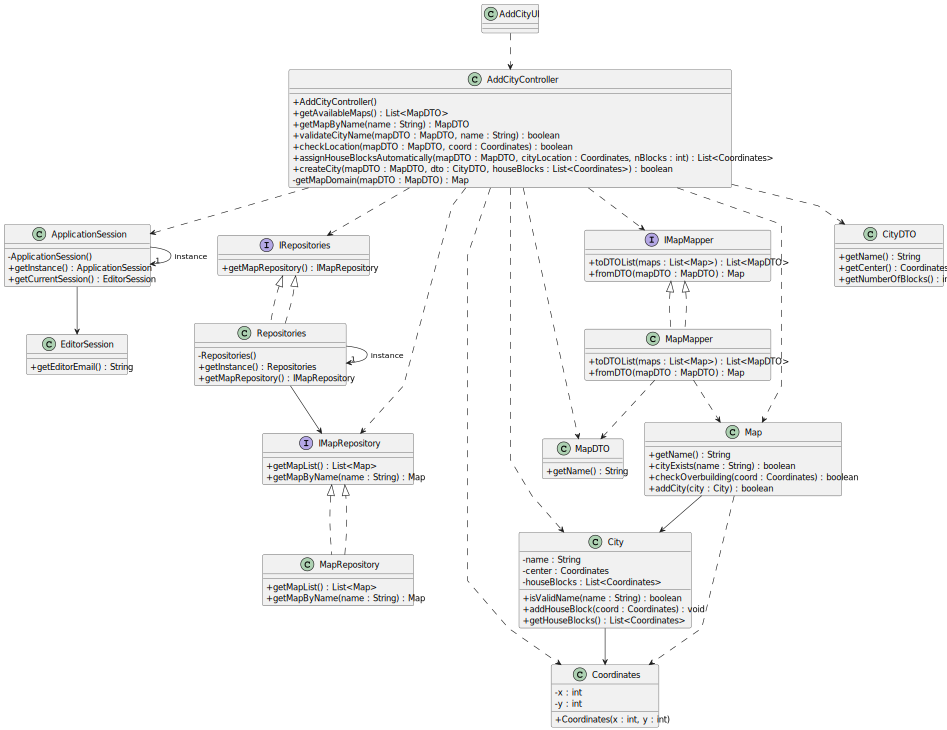

# US003 - Add a City

## 3. Design

### 3.1. Rationale

| Interaction ID | Question: Which class is responsible for...              | Answer               | Justification (with patterns)                                                                                 |
|:---------------|:---------------------------------------------------------|:---------------------|:--------------------------------------------------------------------------------------------------------------|
| Step 1         | ... interacting with the actor?                          | AddCityUI            | Pure Fabrication: there is no reason to assign this responsibility to any existing class in the Domain Model. |
|                | ... coordinating the use case?                           | AddCityController    | Controller                                                                                                    |
|                | ... knowing the current user session?                    | ApplicationSession   | IE: session control is centralized in a singleton object.                                                    |
|                | ... obtaining the user email?                            | UserSession          | IE: user data is encapsulated in session object.                                                              |
| Step 2         | ... accessing repositories?                              | Repositories         | IE: maintains references to all repositories.                                                                 |
|                | ... fetching the list of maps?                           | MapRepository        | IE: is the dedicated gateway to all map data.                                                                 |
| Step 3         | ... converting domain to DTOs?                           | MapMapper            | PF: isolates transformation logic and protects the domain from UI.                                            |
|                | ... creating DTOs from Maps?                             | MapDTO               | Creator: contains the data and initialization logic.                                                          |
|                | ... showing available maps to the user?                  | AddCityUI            | IE: UI is responsible for user interaction.                                                                   |
| Step 4         | ... saving the selected map?                             | AddCityController    | IE: controller holds temporary context during the operation.                                                  |
| Step 5         | ... requesting city name?                                | AddCityUI            | IE: interface must handle data input from the user.                                                           |
|                | ... validating city name uniqueness?                     | AddCityController    | Controller: performs coordination and invokes domain logic.                                                   |
|                | ... checking if city exists in map?                      | Map                  | IE: Map aggregates elements and can check containment.                                                        |
| Step 6         | ... saving the city name?                                | AddCityController    | IE: temporarily stores data until confirmation.                                                               |
|                | ... showing error if name exists?                        | AddCityUI            | IE: UI is responsible for feedback and interaction.                                                           |
| Step 7         | ... requesting city coordinates?                         | AddCityUI            | IE: interface handles all user prompts.                                                                       |
|                | ... checking if city location is valid?                 | AddCityController    | Controller: invokes validation logic on domain.                                                               |
|                | ... validating position against map?                     | Map                  | IE: map knows its boundaries.                                                                                 |
| Step 8         | ... asking for manual or automatic block assignment?     | AddCityUI            | IE: UI controls interaction and options.                                                                      |
| Step 9         | ... assigning house blocks manually?                     | AddCityController    | Controller: orchestrates validation and collection.                                                           |
|                | ... assigning house blocks automatically?                | AddCityController    | Controller: generates and validates blocks in batch.                                                          |
|                | ... validating generated positions?                      | Map                  | IE: owns validation logic.                                                                                    |
| Step 10        | ... showing summary and asking for confirmation?         | AddCityUI            | IE: UI manages confirmation step.                                                                             |
| Step 11        | ... creating City object and adding to map?              | Map                  | Creator: Map is the aggregate root and can create and add its elements.                                       |
| Step 12        | ... confirming success to user?                          | AddCityUI            | IE: UI concludes the interaction with the actor.                                                              |

### Systematization

According to the rationale, the conceptual classes promoted to software classes are:

* Map
* Element (abstract superclass)
* City
* HouseBlock
* Coordinates

Other software classes (i.e., Pure Fabrication) identified:

* AddCityUI
* AddCityController
* Repositories
* MapRepository
* ApplicationSession
* UserSession
* MapMapper
* CityDTO

## 3.2. Sequence Diagram (SD)

This diagram shows the full sequence of interactions between the classes involved in the realization of this user story.

## 3.3. Class Diagram (CD)

