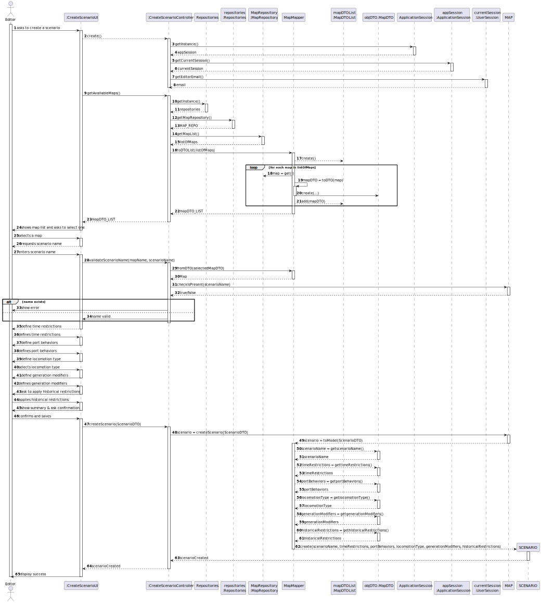
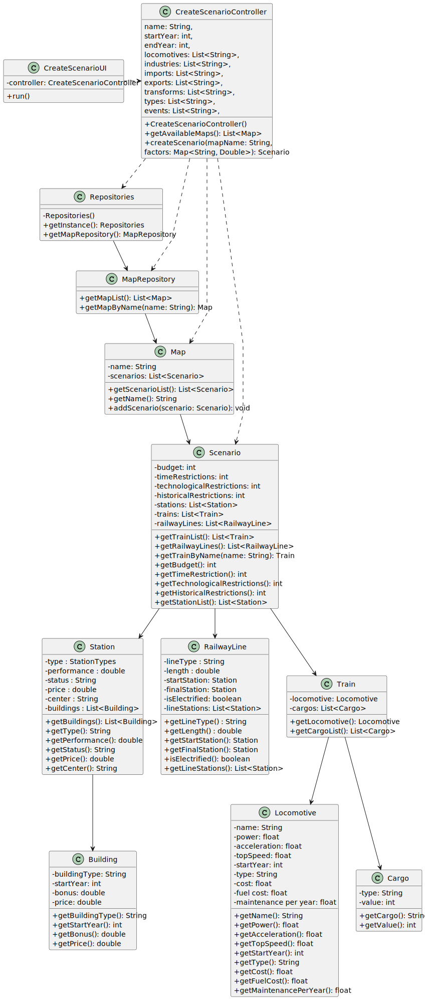

### Rationale Table for US004 – Create Scenario

| Interaction ID | Question: Which class is responsible for...                             | Answer                     | Justification (with patterns)                                                                                                 |
|----------------|-------------------------------------------------------------------------|----------------------------|------------------------------------------------------------------------------------------------------------------------------|
| Step 1         | ... interacting with the actor?                                          | CreateScenarioUI           | **Pure Fabrication**: does not belong to the domain model and is necessary to manage user interaction.                      |
|                | ... coordinating the execution of the US?                               | CreateScenarioController   | **Controller**: coordinates the flow of scenario creation and orchestrates calls to the domain and repositories.            |
| Step 2         | ... knowing the existing maps?                                           | MapRepository              | **Information Expert**: holds the map data; responsible for `getMapList()`.                                                 |
|                |                                                                         | Repositories               | **High Cohesion + Low Coupling**: encapsulates access to several specialized repositories.                                  |
| Step 3         | ... checking if the scenario name is valid?                             | Map                        | **Information Expert**: contains the list of `Scenario`, knows the existing names and can check for duplicates.             |
| Step 4         | ... temporarily holding the new scenario's data before creation?        | CreateScenarioUI           | **Information Expert**: responsible for collecting the user's input data sequentially.                                       |
| Step 5         | ... instantiating the new scenario?                                     | CreateScenarioController   | **Creator (Rule 3)**: has the necessary data and encapsulates the creation based on UI inputs.                              |
| Step 6         | ... validating the scenario data (restrictions, years, types)?          | CreateScenarioController   | **Information Expert**: simple validations delegated to the controller before persisting the scenario.                      |
| Step 7         | ... saving the new scenario in the map?                                 | Map                        | **Creator (Rule 1)**: the `Map` contains a list of `Scenario`, so it should create/add the new scenario.                    |
| Step 8         | ... confirming the success of the operation to the user?                | CreateScenarioUI           | **Information Expert**: manages final messages and communication with the actor.                                             |

---

### Systematization

According to the taken rationale, the conceptual classes promoted to software classes are:
- Map
- Scenario

Other software classes (i.e. Pure Fabrication) identified:
- CreateScenarioUI
- CreateScenarioController
- Repositories
- MapRepository

## 3.2. Sequence Diagram (SD)

### Full Diagram

This diagram shows the full sequence of interactions between the classes involved in the realization of this user story.

## 3.3. Class Diagram (CD)

