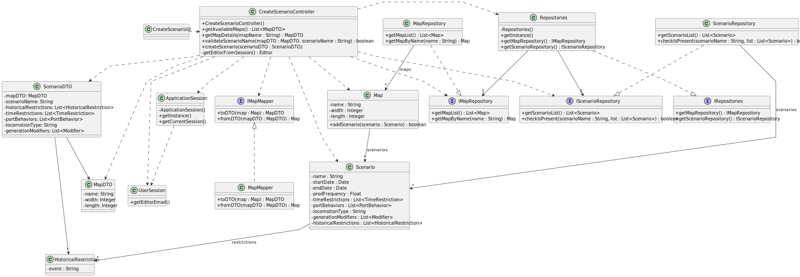

# US004 - Create a scenario for a selected map

## 3. Design

### 3.1. Rationale

| Interaction ID | Question: Which class is responsible for...                                                 | Answer                     | Justification (with patterns)                                                                    |
|----------------|---------------------------------------------------------------------------------------------|----------------------------|--------------------------------------------------------------------------------------------------|
| Step 1         | ... initiating the interaction with the actor (Editor)?                                     | CreateScenarioUI           | **Pure Fabrication**: handles presentation logic, promoting separation of concerns.              |
| Step 2         | ... instantiating the controller for scenario creation?                                     | CreateScenarioUI           | **Controller**: delegates coordination to a dedicated controller object.                         |
| Step 3         | ... retrieving the user session context (editor email)?                                     | ApplicationSession         | **Singleton** with **Protected Variations**: centralizes and encapsulates session access.        |
| Step 4         | ... obtaining the list of available maps from persistence?                                  | MapRepository              | **Information Expert**: knows how and where to retrieve map data.                                |
| Step 5         | ... converting each map into a MapDTO (in loop)?                                            | MapMapper                  | **Pure Fabrication**: isolates transformation logic, enhancing **Low Coupling**.                 |
| Step 6         | ... compiling the list of DTOs to return to UI?                                             | CreateScenarioController   | **Controller** with **High Cohesion**: manages orchestration while delegating specialized tasks. |
| Step 7         | ... presenting the map list and requesting a selection?                                     | CreateScenarioUI           | **Pure Fabrication**: interacts with the user interface layer.                                   |
| Step 8         | ... retrieving the selected map’s full details?                                             | MapRepository              | **Information Expert**: provides access to map domain details.                                   |
| Step 9         | ... requesting and receiving the scenario name?                                             | CreateScenarioUI           | **Pure Fabrication**: receives textual input from the user.                                      |
| Step 10        | ... validating that the scenario name does not already exist in the map?                    | Map                        | **Information Expert**: owns scenarios and validates their uniqueness.                           |
| Step 11        | ... showing an error message if the name is taken?                                          | CreateScenarioController   | **Controller**: enforces application logic flow and feedback.                                    |
| Step 12        | ... requesting and displaying time restrictions configuration?                              | CreateScenarioUI           | **Pure Fabrication**: responsible for UI-based data acquisition.                                 |
| Step 13        | ... collecting all configuration data (ports, locomotion, modifiers, restrictions)?         | CreateScenarioUI           | **Pure Fabrication**: gathers all configuration data without touching domain logic.              |
| Step 14        | ... packaging the scenario data for backend processing?                                     | ScenarioDTO                | **Protected Variations**: shields the system from changes in data representation.                |
| Step 15        | ... converting the DTO into a domain object (Scenario)?                                     | ScenarioMapper             | **Pure Fabrication** + **Low Coupling**: separates transformation logic from business logic.     |
| Step 16        | ... creating and linking the new scenario to its map?                                       | Map                        | **Creator** pattern: aggregate root responsible for managing its contained scenarios.            |
| Step 17        | ... storing the created scenario persistently?                                              | ScenarioRepository         | **Information Expert**: manages persistent storage for scenarios.                                |
| Step 18        | ... showing a final success message to the editor?                                          | CreateScenarioUI           | **Pure Fabrication**: completes interaction cycle through visual feedback.                       |

### Systematization

According to the taken rationale, the conceptual classes promoted to software classes are:

* Scenario
* HistoricalRestrictions
* Map

Other software classes (Pure Fabrication):

* CreateScenarioUI
* CreateScenarioController
* Repositories
* ScenarioRepository
* MapRepository
* ApplicationSession
* UserSession
* ScenarioDTO
* MapDTO
* MapMapper

 
---

## 3.2. Sequence Diagram (SD)

### Full Diagram

This diagram represents the full sequence of interactions for scenario creation, with clear role separation and use of DTOs to shield the domain model.

---

## 3.3. Class Diagram (CD)

This diagram depicts domain, UI, and infrastructure classes, as well as mappers and DTOs with protective boundaries around the core model.

