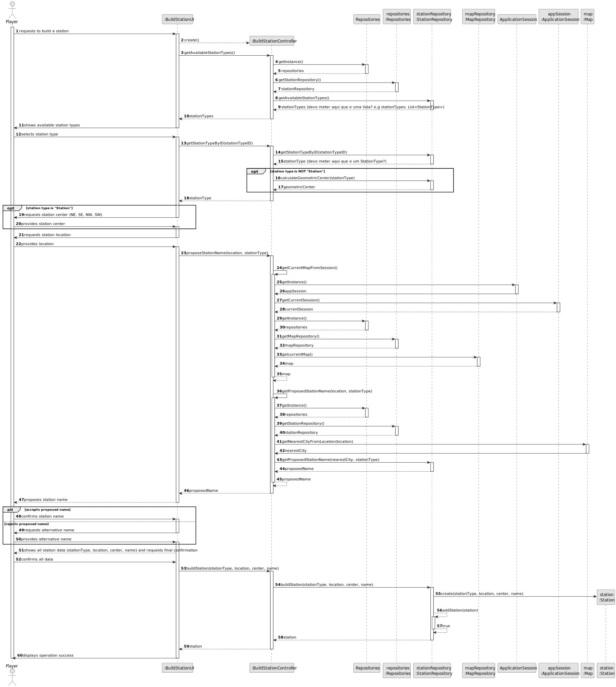
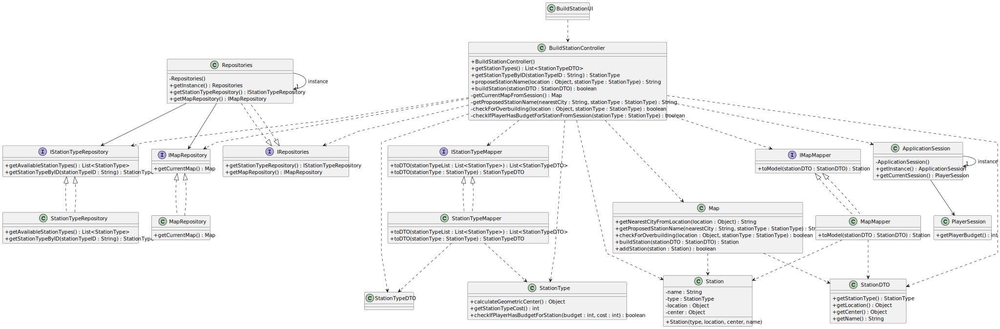

# US005 - Build a Station

## 3. Design

### 3.1. Rationale

| Interaction ID | Question: Which class is responsible for...                | Answer                   | Justification (with patterns)                                                                                  |
|:---------------|:-----------------------------------------------------------|:-------------------------|:---------------------------------------------------------------------------------------------------------------|
| Step 1         | ... interacting with the actor?                            | BuildStationUI           | Pure Fabrication: responsible for all user interactions.                                                       |
|                | ... coordinating the US?                                   | BuildStationController   | Controller: coordinates the flow between UI, repositories, and entities.                                       |
| Step 2         | ... obtaining the repositories singleton?                  | Repositories             | IE: maintains access to all repositories.                                                                      |
| Step 3         | ... obtaining the StationRepository?                       | Repositories             | IE: provides access to StationRepository.                                                                      |
| Step 4         | ... knowing the available station types?                   | StationRepository        | IE: manages and provides available station types.                                                              |
| Step 5         | ... showing available station types to the player?         | BuildStationUI           | IE: responsible for presenting data to the user.                                                               |
| Step 6         | ... getting the station type by ID?                        | StationRepository        | IE: provides the station type corresponding to the given ID.                                                   |
| Step 7         | ... calculating the geometric center (if needed)?          | StationRepository        | IE: responsible for calculations related to stations.                                                          |
| Step 8         | ... requesting the station center (if type is Station)?    | BuildStationUI           | IE: responsible for user input.                                                                                |
| Step 9         | ... requesting the station location?                       | BuildStationUI           | IE: responsible for user input.                                                                                |
| Step 10        | ... proposing the station name?                            | BuildStationController   | Controller: coordinates the name proposal process.                                                             |
| Step 11        | ... obtaining the current map from session?                | ApplicationSession       | IE: ApplicationSession manages session and current map context.                                                |
| Step 12        | ... getting the current map?                               | MapRepository            | IE: provides the current map.                                                                                  |
| Step 13        | ... getting the nearest city from location?                | Map                      | IE: knows all cities and their locations.                                                                      |
| Step 14        | ... proposing a contextual station name?                   | StationRepository        | IE: proposes a name based on nearest city and station type.                                                    |
| Step 15        | ... showing the proposed name to the player?               | BuildStationUI           | IE: responsible for user interaction.                                                                          |
| Step 16        | ... handling name acceptance or alternative name?          | BuildStationUI           | IE: responsible for user interaction.                                                                          |
| Step 17        | ... showing all station data and requesting confirmation?  | BuildStationUI           | IE: responsible for user interaction.                                                                          |
| Step 18        | ... building the station?                                  | StationRepository        | Creator: responsible for creating and persisting the station.                                                  |
| Step 19        | ... creating the Station entity?                           | Station                  | Creator: StationRepository creates Station entity.                                                             |
| Step 20        | ... adding the station to the repository?                  | StationRepository        | IE: owns and manages all stations.                                                                             |
| Step 21        | ... informing operation success?                           | BuildStationUI           | IE: responsible for user feedback.                                                                             |

### Systematization ##

According to the taken rationale, the conceptual classes promoted to software classes are:

* Map
* Station

Other software classes (i.e. Pure Fabrication, Controller) identified:

* BuildStationUI
* BuildStationController
* Repositories
* StationRepository
* MapRepository

## 3.2. Sequence Diagram (SD)

### Full Diagram

This diagram shows the full sequence of interactions between the classes involved in the realization of this user story.

## 3.3. Class Diagram (CD)

