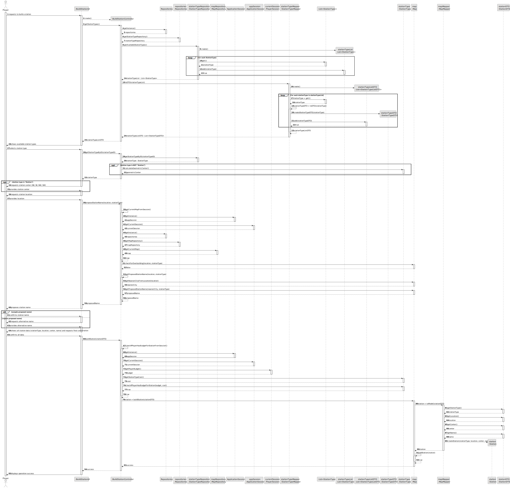

# US005 - Build a Station

## 3. Design

### 3.1. Rationale

| Interaction ID | Question: Which class is responsible for...                 | Answer                 | Justification (with patterns)                                                                     |
|:---------------|:------------------------------------------------------------|:-----------------------|:--------------------------------------------------------------------------------------------------|
| Step 1         | ... interacting with the actor?                             | BuildStationUI         | Pure Fabrication: there is no reason to assign this responsibility to any existing domain class.  |
|                | ... coordinating the US?                                    | BuildStationController | Controller: coordinates the flow between UI, repositories, and domain entities for this use case. |
| Step 2         | ... obtaining the repositories singleton?                   | Repositories           | Information Expert: maintains access to all repositories.                                         |
| Step 3         | ... obtaining the StationTypeRepository?                    | Repositories           | Information Expert: provides access to StationTypeRepository.                                     |
| Step 4         | ... knowing the available station types?                    | StationTypeRepository  | Information Expert: manages and provides available station types.                                 |
| Step 5         | ... creating the list of StationType?                       | StationTypeRepository  | Creator: responsible for creating the list of StationType objects.                                |
| Step 6         | ... mapping StationType to StationTypeDTO?                  | StationTypeMapper      | Pure Fabrication: separates mapping logic from domain classes.                                    |
| Step 7         | ... creating the list of StationTypeDTO?                    | StationTypeMapper      | Creator: responsible for creating DTOs from domain objects.                                       |
| Step 8         | ... returning the list of StationTypeDTO to the controller? | StationTypeMapper      | Pure Fabrication: responsible for data transformation and transfer.                               |
| Step 9         | ... passing the list of StationTypeDTO to the UI?           | BuildStationController | Controller: coordinates data flow between domain and UI.                                          |
| Step 10        | ... showing available station types to the player?          | BuildStationUI         | Pure Fabrication: responsible for presenting data to the user.                                    |
| Step 11        | ... getting the StationType by ID?                          | StationTypeRepository  | Information Expert: provides the station type corresponding to the given ID.                      |
| Step 12        | ... calculating the geometric center (if needed)?           | StationType            | Information Expert: responsible for calculations related to its own data.                         |
| Step 13        | ... returning the StationType to the UI?                    | BuildStationController | Controller: coordinates the flow of data to the UI.                                               |
| Step 14        | ... requesting the station center (if type is Station)?     | BuildStationUI         | Pure Fabrication: responsible for user input.                                                     |
| Step 15        | ... requesting the station location?                        | BuildStationUI         | Pure Fabrication: responsible for user input.                                                     |
| Step 16        | ... proposing the station name?                             | BuildStationController | Controller: coordinates the name proposal process.                                                |
| Step 17        | ... obtaining the current map from session?                 | ApplicationSession     | Information Expert: manages session and current map context.                                      |
| Step 18        | ... providing the current session?                          | ApplicationSession     | Information Expert: provides access to the current player session.                                |
| Step 19        | ... obtaining the MapRepository?                            | Repositories           | Information Expert: provides access to MapRepository.                                             |
| Step 20        | ... providing the MapRepository?                            | Repositories           | Information Expert: maintains access to all repositories.                                         |
| Step 21        | ... getting the current map?                                | MapRepository          | Information Expert: provides the current map.                                                     |
| Step 22        | ... checking for overbuilding?                              | Map                    | Information Expert: knows all stations and their locations.                                       |
| Step 23        | ... getting the nearest city from location?                 | Map                    | Information Expert: knows all cities and their locations.                                         |
| Step 24        | ... proposing a contextual station name?                    | Map                    | Information Expert: proposes a name based on nearest city and station type.                       |
| Step 25        | ... passing the proposed name to the UI?                    | BuildStationController | Controller: coordinates data flow between domain and UI.                                          |
| Step 26        | ... showing the proposed name to the player?                | BuildStationUI         | Pure Fabrication: responsible for user interaction.                                               |
| Step 27        | ... handling name acceptance or alternative name?           | BuildStationUI         | Pure Fabrication: responsible for user interaction.                                               |
| Step 28        | ... showing all station data and requesting confirmation?   | BuildStationUI         | Pure Fabrication: responsible for user interaction.                                               |
| Step 29        | ... building the station?                                   | BuildStationController | Controller: coordinates the station creation process.                                             |
| Step 30        | ... checking the player's budget?                           | BuildStationController | Controller: coordinates the budget validation process.                                            |
| Step 31        | ... obtaining the player's budget?                          | PlayerSession          | Information Expert: knows the player's budget.                                                    |
| Step 32        | ... obtaining the station type cost?                        | StationType            | Information Expert: knows its own cost.                                                           |
| Step 33        | ... checking if player has enough budget?                   | StationType            | Information Expert: can validate if the player can afford this station type.                      |
| Step 34        | ... building the station on the map?                        | Map                    | Information Expert: responsible for creating and adding the station to itself.                    |
| Step 35        | ... mapping StationDTO to Station?                          | MapMapper              | Pure Fabrication: separates mapping logic from domain classes.                                    |
| Step 36        | ... creating the Station entity?                            | MapMapper              | Creator: responsible for instantiating Station objects.                                           |
| Step 37        | ... adding the station to the map?                          | Map                    | Information Expert: owns and manages all stations.                                                |
| Step 38        | ... returning the success of the operation?                 | Map                    | Information Expert: knows the result of the add operation.                                        |
| Step 39        | ... passing the success to the UI?                          | BuildStationController | Controller: coordinates the flow of operation results to the UI.                                  |
| Step 40        | ... showing operation success to the player?                | BuildStationUI         | Pure Fabrication: responsible for user feedback.                                                  |

### Systematization ##

According to the taken rationale, the conceptual classes promoted to software classes are:

* Map
* Station
* StationType

Other software classes (i.e. Pure Fabrication, Controller) identified:

* BuildStationUI
* BuildStationController
* Repositories
* StationTypeRepository
* MapRepository
* ApplicationSession
* PlayerSession
* StationTypeMapper
* MapMapper
* StationTypeDTO
* StationDTO

## 3.2. Sequence Diagram (SD)

### Full Diagram

This diagram shows the full sequence of interactions between the classes involved in the realization of this user story.

## 3.3. Class Diagram (CD)

