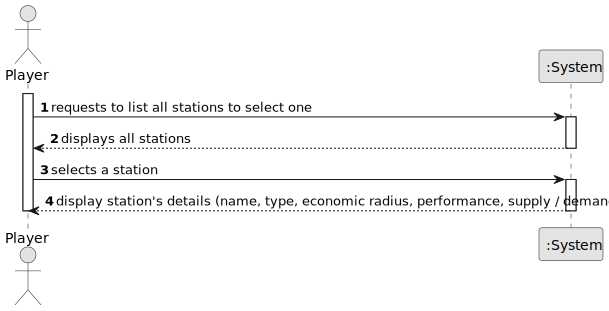

# US007 - List all Stations

## 1. Requirements Engineering

### 1.1. User Story Description

As a Player, I want to list all the stations to select one to see its details, including the existing building and the demand/supply cargoes.

### 1.2. Customer Specifications and Clarifications 

**From the specifications document:**

> Each station is characterized by having a unique name, type, economic radius, cost, status, supply, and demand.

> The player should be able to view the details of a selected station, including the existing buildings and the demand/supply cargoes.

**From the client clarifications:**

> **Question:**
When the user selects an existing station, does it automatically show all the associated info to that station or the user selects the station then has to select the required option ? eg: 'show details'
>
> **Answer:** That's a matter of UX/UI, each team can decide what works best.

> **Question:** What information should be visible directly in the list? Just the station name, or also other details like type, location, and operational status (active/inactive), etc.?
>
> **Answer:** Name and a summary of available cargos to be collected and the ones that are demanded.
> 
> **Question:** Besides the existing buildings and demand/supply cargo, are there any other details that should be shown when viewing a station's information? For example, location, capacity, or operational status?
> 
> **Answer:** Available cargos to be collected and the ones that are demanded.

### 1.3. Acceptance Criteria

* **AC1:** The system must display a list of all stations.
* **AC2:** The player must be able to select a station from the list.
* **AC3:** The system must display the details of the selected station, including existing buildings and demand/supply cargoes.

### 1.4. Found out Dependencies

* **US05:** As a Player, I want to build a station (can be a depot, a station, or a terminal) with a location in the current map.
  - It's necessary to have existing stations to list and view their details.

* **US06:** As a Player, I want to upgrade a selected station with a building.
  - The details of a station include existing buildings which may be upgraded.

### 1.5 Input and Output Data

**Input Data:**
	
* Selected data:
    * a station

**Output Data:**

* List of all stations.
* Details of the selected station (name, supply / demand) and cargo status

### 1.6. System Sequence Diagram (SSD)

**_Other alternatives might exist._**

### 1.7 Other Relevant Remarks

* N/A