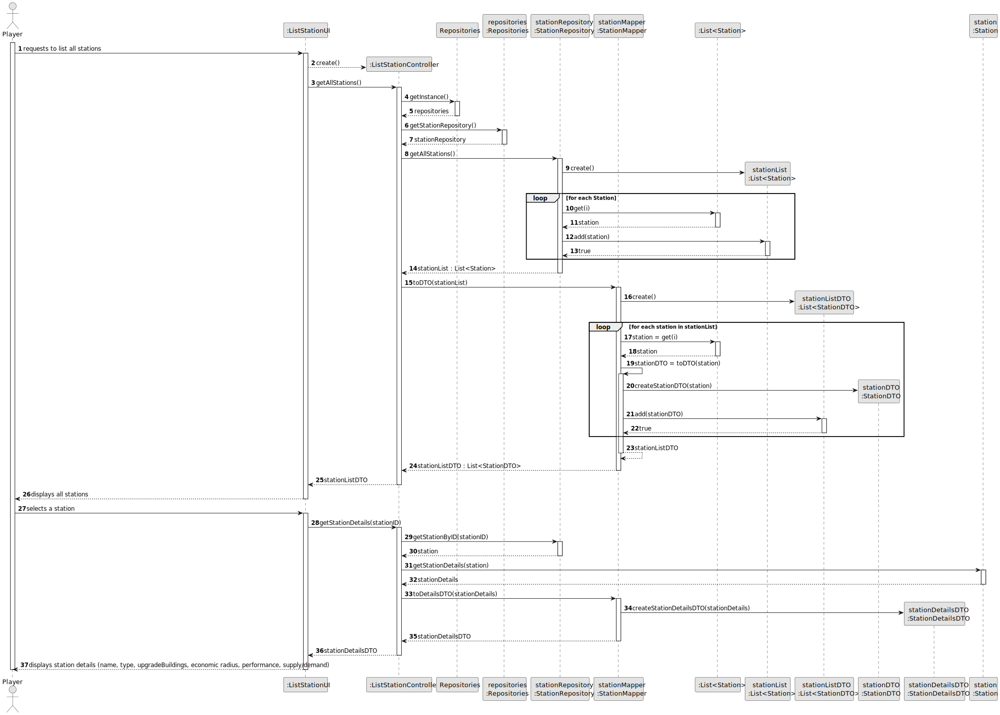
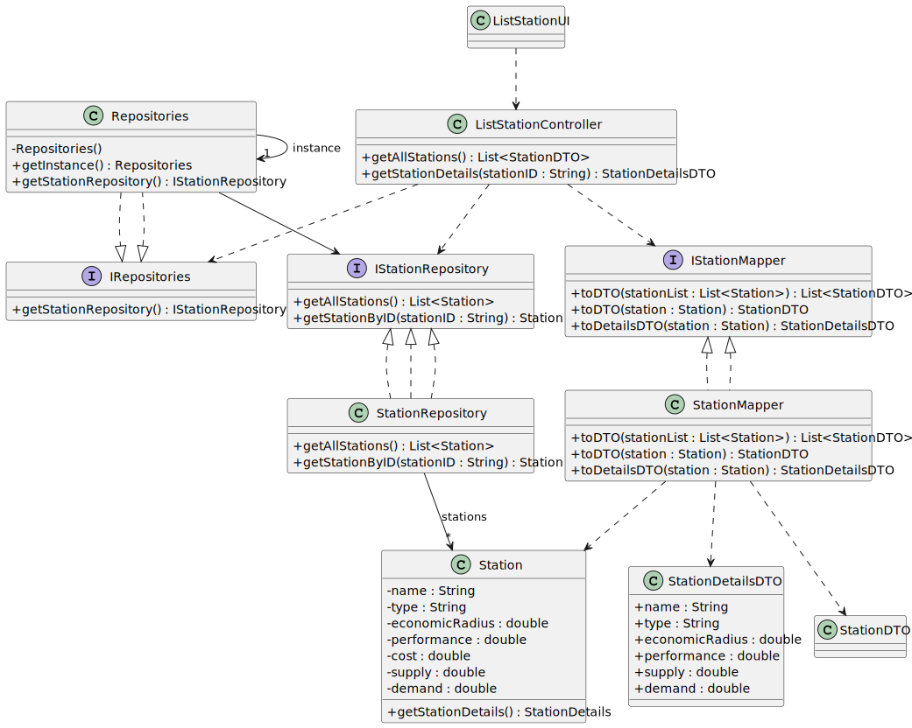

# US007 - List all Stations

## 3. Design

### 3.1. Rationale

| Interaction ID | Question: Which class is responsible for...                 | Answer                        | Justification (with patterns)                                                                                                   |
|:---------------|:------------------------------------------------------------|:------------------------------|:--------------------------------------------------------------------------------------------------------------------------------|
| Step 1         | ... interacting with the actor?                             | ListStationUI                 | Pure Fabrication: there is no reason to assign this responsibility to any existing class in the Domain Model.                   |
|                | ... coordinating the US?                                    | ListStationController         | Controller: coordinates the flow between UI, repositories, mappers, and domain entities for this use case.                      |
| Step 2         | ... obtaining the repositories singleton?                   | Repositories                  | Information Expert: maintains access to all repositories.                                                                       |
| Step 3         | ... obtaining the StationRepository?                        | Repositories                  | Information Expert: provides access to StationRepository.                                                                       |
| Step 4         | ... knowing all existing stations to show?                  | StationRepository             | Information Expert: manages and provides all stations.                                                                          |
| Step 5         | ... creating the list of Station?                           | StationRepository             | Creator: responsible for creating the list of Station objects.                                                                  |
| Step 6         | ... mapping Station to StationDTO?                          | StationMapper                 | Pure Fabrication: separates mapping logic from domain classes.                                                                  |
| Step 7         | ... creating the list of StationDTO?                        | StationMapper                 | Creator: responsible for creating DTOs from domain objects.                                                                     |
| Step 8         | ... returning the list of StationDTO to the controller?     | StationMapper                 | Pure Fabrication: responsible for data transformation and transfer.                                                             |
| Step 9         | ... passing the list of StationDTO to the UI?               | ListStationController         | Controller: coordinates data flow between domain and UI.                                                                        |
| Step 10        | ... showing all stations to the player?                     | ListStationUI                 | Pure Fabrication: responsible for presenting data to the user.                                                                  |
| Step 11        | ... retrieving the station by ID?                           | StationRepository             | Information Expert: provides the station corresponding to the given ID.                                                         |
| Step 12        | ... retrieving the station details?                         | Station                       | Information Expert: knows its own data and provides its details.                                                                |
| Step 13        | ... mapping Station to StationDetailsDTO?                   | StationMapper                 | Pure Fabrication: separates mapping logic from domain classes.                                                                  |
| Step 14        | ... returning the StationDetailsDTO to the controller?      | StationMapper                 | Pure Fabrication: responsible for data transformation and transfer.                                                             |
| Step 15        | ... passing the StationDetailsDTO to the UI?                | ListStationController         | Controller: coordinates data flow between domain and UI.                                                                        |
| Step 16        | ... showing the station details to the player?              | ListStationUI                 | Pure Fabrication: responsible for presenting data to the user.                                                                  |

### Systematization ##

According to the taken rationale, the conceptual classes promoted to software classes are:

* Station

Other software classes (i.e. Pure Fabrication, Controller, Mapper, DTO, Interface) identified:

* ListStationUI
* ListStationController
* Repositories
* StationRepository
* IRepositories
* IStationRepository
* StationMapper
* IStationMapper
* StationDTO
* StationDetailsDTO

## 3.2. Sequence Diagram (SD)

### Full Diagram

This diagram shows the full sequence of interactions between the classes involved in the realization of this user story.

## 3.3. Class Diagram (CD)

